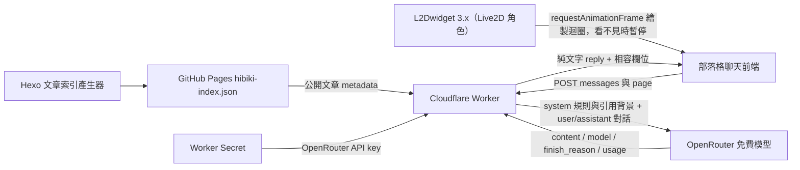
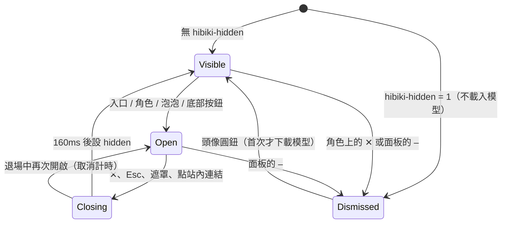
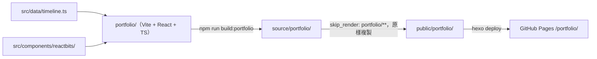

# 系統設計：Hibiki 聊天

本文件記錄此次調整涉及的 Hibiki 元件，其他部落格功能仍見各自的 `docs/decisions/`。更新日期：2026-09-28。

## 元件與資料來源

- 前端將可見 user/assistant 歷史與目前文章節錄送往 Worker；不持有 OpenRouter 金鑰。
- 文章索引由 Hexo 在建置時產生，包含 title/url/date/tags/excerpt，不是對話紀錄。當前文章 text 由前端擷取，仍只是前 6,000 字。
- Worker 無資料庫與使用者 session。索引僅在 isolate 內快取，依 INDEX_URL 區別；成功一小時，失敗或無可用文章五分鐘。
- 自動取得的資料是引用內容，沒有指令效力。Worker 把它與來源說明放在 system 的 `site_reference_data` 區塊；JSON 內的 `<`、`>` 跳脫，固定品質規則接在區塊後。訪客的 user 訊息不拼入網站資料、人設或品質指令。
- 所有模型都使用 system role；覆寫模型若拒絕該 role，以現有錯誤備援切換，不偽造訪客曾說過設定或資料。

## 前端版面與顯示狀態

`themes/cactus/source/js/live2d-chat.js` 的 `syncLayout()` 是唯一控制點：依視窗尺寸決定模式，並以 `dismissed`（訪客收起 Hibiki，存在 `localStorage` 的 `hibiki-hidden`）收斂所有浮動元素。樣式在 `themes/cactus/source/css/_live2d.styl`。

| 模式 | 條件 | 入口 | 聊天面板 | 待機泡泡 |
|---|---|---|---|---|
| `full` | 寬 ≥ 960 且高 ≥ 520，且 L2Dwidget 已載入 | Live2D 角色（right 26、92×184）＋左側「問 Hibiki」 | right 128 / bottom 24，取代入口的位置 | 頭頂上方 bottom 196，尾巴對準角色中心 |
| `compact` | 其餘寬 ≥ 500，或手機非文章頁 | 「問 Hibiki」 right 24 / bottom 76（手機 16 / 74）；< 700px 往下捲時收成 44px 圓鈕 | ≥ 500：right 24 / bottom 76，取代入口；< 500：bottom sheet | bottom 132，入口上方；< 500 不顯示 |
| `mobilebar` | 寬 < 500 且頁面有 `#actions-footer`（文章頁） | 底部操作列的 Hibiki 按鈕，無浮動元素 | bottom sheet | 不顯示 |

- 960 的由來：文章欄 720px 置中，右側留白要放得下角色的 118px（26 + 92）。窄於此角色會站在內文上，透明 hitbox 還會擋住連結。
- 面板只有紀錄區會縮（`min-height: clamp(0px, 100vh - 300px, 120px)`），`overflow: clip` 讓 `focus()` 無法捲動面板，短螢幕時標題列不會被捲出去。
- 觸控手機（寬 < 500 且 `pointer: coarse`）開啟時 focus 對話框本身，不自動彈出鍵盤；其餘 focus 輸入框。

- 開關由 `showEl()` / `hideEl()` 處理：退場先加 `.is-leaving` 播 160ms 反向動畫再設 `hidden`，退場中不接收點擊（`#waifu-chat > .is-leaving`）；`prefers-reduced-motion` 時直接切換。泡泡 6.5 秒後同樣以退場動畫消失。
- Live2D 暫停：L2Dwidget 沒有暫停 API，`live2d-chat.js` 包裝 `window.requestAnimationFrame`，只攔第二參數是 `#live2dcanvas` 的呼叫。角色看不見（`dismissed` 或不在 `full`）時停住，出現時接回同一條迴圈。決策見 `docs/decisions/2026-09-28-hibiki-live2d-raf-pause.md`。

## POST 聊天介面

沿用現有 Worker 網址與 POST/OPTIONS，沒有新增 endpoint。CORS 預設允許正式站及 localhost:4000，回傳 `Vary: Origin`；CORS 不等於濫用防護。

| 方向 | 欄位 | 說明 |
|---|---|---|
| Request | `messages` | `{role: user\|assistant, content: string}[]`；忽略客戶端 system 及無效/空白訊息，尾端必須是 user |
| Request | `page` | 選填 `{title, text}`；title 最多 100 字，text 最多 6,000 字 |
| Response | `reply` | 已清理 Markdown 的純文字；保留換行、顏文字、站內路徑 |
| Response | `model` | 上游回報的實際模型；缺少有效 ID 時使用此次要求的模型 |
| Response | `finish_reason` | `stop`、`length` 或 `null`（上游未提供）；未知結束原因不視為完成 |
| Response | `truncated` | 已知輸出截斷且仍有可用片段時為 true；同時在 reply 附未完成提示供舊前端顯示 |
| Error | `error` | 穩定的分類文字，不透傳供應商原始錯誤 |

HTTP 狀態：錯誤 JSON 或無有效 user 訊息為 400；錯誤 method 為 405；請求 body 讀取逾時為 408；缺少 key 或不允許的 MODEL 為 500；上游全部失敗且沒有可用片段為 502。成功與明示未完成的可用片段均為 200。

歷史限制為最近 20 則、每則前 2,000 字、合計 16,000 字，使用 JavaScript 字串長度。從最新輪次往回保留，超限刪最舊整輪，剔除缺少問題的開頭 assistant。**目前前端只傳最近 10 則，Worker 無法補回未收到的舊問題；換文章或重新整理仍會清空前端歷史。**

## 上游請求流程

1. 從進入 fetch 起計算全請求 60 秒期限；驗證 method、key、免費 MODEL 與 body。
2. 抓取或讀取索引快取；抓取加 JSON 解析共最多三秒，也不能超過全請求期限。失敗標示無索引，聊天繼續。
3. 組裝人設、來源明確的引用背景、固定品質規則及原始角色對話。固定規則優先於自訂人設中的舊長度限制。
4. 模型順序為 MODEL（若有）→ Qwen3.8 27B free → Ling 3.0 Flash Sante free，去重。僅允許具名 `:free` ID，拒絕 OpenRouter 動態路由；provider 輸入/輸出/單次請求價格上限皆設為 0。
5. 正常預算 1,200 tokens、temperature 0.6；Qwen 的模型專屬參數關閉可選推理，其他模型不送未確認的推理參數。
6. 遇到 `length`，全請求最多一次同模型重新生成，預算 2,400 tokens，重新回答原問題，不拼接未完成內容。再截斷時回傳可用片段與未完成提示；沒有可用片段或重試故障則可用備援。
7. 每次模型呼叫最多 25 秒（包含 body），整個請求最多三次模型呼叫且共享 60 秒期限。遇 401/403 停止，不因 body 非 JSON 而繼續；內容過濾直接回錯誤，不切換模型繞過。
8. 清理完成的文字後回傳；備援耗盡但保留過可用截斷片段時，明示未完成。每次嘗試記錄結束原因、耗時與 token 用量，不記錄文字內容。

## 對話品質與驗證邊界

- 閒聊自然簡短；技術解釋通常 200–400 字，不強迫所有問題都變成部落格導覽。
- 文章節錄與索引摘要不能當成全文；只推薦真實索引項目，未知內容要明說。
- 不主動提 JSON 或內部機制；問資料來源時說網站自動提供的公開文章資料。若先前把背景資料說成訪客貼的，承認錯誤；不把先前 assistant 的誤述當證據。
- Node 原生測試驗證真實 Worker 入口的資料流、期限與回傳，來源歸因案例驗證 user 訊息未被程式附加背景資料污染。模型實際理解、繁體中文品質與資訊正確性仍需要固定問答人工比較；流程見 Worker README。
- 本次未新增串流、長期記憶、速率限制、全文檢索或資料庫，也未部署至正式環境。

---

# 系統設計：Portfolio SPA（/portfolio/）

獨立的作品精選頁，只從外部連結（作品集 QR code）進入，部落格選單不連入。決策見 `docs/decisions/2026-09-28-portfolio-spa-react.md`。更新日期：2026-09-28。

## 元件與建置流程

- `portfolio/` 是獨立的 npm 專案；React、gsap、motion 只打包在這一頁，cactus 主題與其他頁面不受影響。
- build 產物進版控。修改 `portfolio/` 後必須重跑 `npm run build:portfolio`，`hexo generate` 只負責複製。
- 頁面帶 `<meta name="robots" content="noindex, nofollow">`；`<noscript>` 內有純連結清單。

## 頁面區塊

| 區塊 | 檔案 | 內容 | 動畫 |
|---|---|---|---|
| Hero | `sections/Hero.tsx` | 姓名、學校與職稱兩行（對應研究／工程兩軌的顏色）、自我介紹；右側為 UAV 原始影格 → 7×5 切片掃描 → 2024 年系統實際輸出與 CCI／PAI | Decrypted Text；切片位置由 `lib/tiles.ts`（移植自 project repo 的 `inference.py`）計算 |
| 雙軌時間軸 | `sections/DualTimeline.tsx` | 研究／工程兩軌，資料來自 `data/timeline.ts`；軸線終點為「NOW」標記 | Animated Content、Count Up |
| 學習方式 | `sections/Practice.tsx` | 學習循環與寫作觀 | Scroll Reveal（逐字） |
| 匯合 | `sections/Converge.tsx` | 定位句與聯絡方式 | 無 |

## 時間軸資料（`data/timeline.ts`）

| 欄位 | 用途 |
|---|---|
| `track` | `research` 或 `engineering`，決定左右欄與顏色 |
| `date`／`sortKey` | 顯示用日期與排序用日期；同一 `sortKey` 依陣列順序（sort 為 stable） |
| `tag` | 類型標籤，例如「競賽」「Side Project」「寫作」 |
| `compact` | 小卡：獎項、里程碑等沒有圖片的節點 |
| `image` | 真實截圖或系統輸出；UI 截圖用 `fit: 'contain'` 避免裁切 |
| `links` | 文章／GitHub 按鈕 |
| `stats` | Count Up 數字，另提供螢幕閱讀器用的最終值 |
| `cases` | 工作案例子項（標題 + 說明） |

- 節點只收有 repo、文章或作者確認來源的項目；日期不明的項目不放，或與同類節點合併。

- Target Cursor 只在 `(hover: hover) and (pointer: fine) and (min-width: 769px)` 且未開啟減少動態時載入。
- `prefers-reduced-motion: reduce` 時：Hero 直接顯示結果、文字不打亂、卡片直接顯示、數字顯示最終值、引言不拆字。
- 所有影像都是真實資料（專題影格、系統輸出、實際執行截圖、文章內的圖），不繪製模型沒有輸出過的偵測框。
