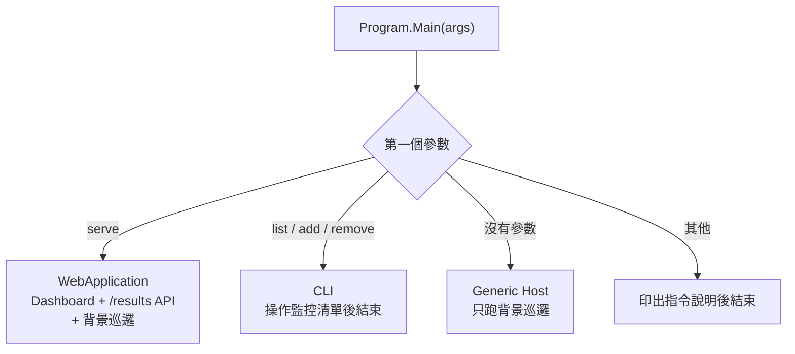

UrlHealthMonitor 是我第一次用 .NET 寫後端的小專案：定期對一組網址發 HTTP GET，記下狀態碼跟耗時，存進 SQLite，再用一個網頁 Dashboard 顯示最近 100 筆結果。

規模不大，但剛好會碰到後端的幾個基本元件：背景服務、依賴注入、資料庫、HTTP 用戶端，以及容器化。這篇照著程式實際的結構，一塊一塊拆開來看。

<!-- more -->

## 一支程式，三種用法

整個專案只有一個執行檔。`Program.Main` 看第一個參數決定要扮演什麼角色：



`serve` 模式把網頁伺服器跟背景巡邏放在同一個 process 裡，靠依賴注入把元件組起來：

```csharp
// UrlHealthMonitorApp/Program.cs
            if (args.Length > 0 && args[0].ToLowerInvariant() == "serve")
            {
                var builder = WebApplication.CreateBuilder();

                builder.Services.AddSingleton<Database>(_ => new Database(dbPath));
                builder.Services.AddSingleton<StatusChecker>();
                builder.Services.AddHostedService<MonitorService>();
```

`AddHostedService` 註冊的 `MonitorService` 會跟著網頁伺服器一起啟動、一起關閉。資料庫路徑則從環境變數 `DATABASE_PATH` 讀，沒設定就用 `results.db`。

監控清單用 CLI 管理。實際執行長這樣：

```text
$ dotnet run -- add https://reedlin2002.github.io/
已新增 URL：https://reedlin2002.github.io/
$ dotnet run -- add https://httpbin.org/status/404
已新增 URL：https://httpbin.org/status/404
$ dotnet run -- add https://httpbin.org/status/503
已新增 URL：https://httpbin.org/status/503
$ dotnet run -- list
目前監控 URL：
1: https://reedlin2002.github.io/
2: https://httpbin.org/status/404
3: https://httpbin.org/status/503
```

`remove` 吃的是 `list` 列出來的 ID，不是網址。

這裡有個設計很方便：**CLI 跟背景巡邏是兩個不同的 process，它們之間不直接溝通，而是共用同一個 SQLite 檔案。** CLI 寫入監控清單，背景巡邏每一輪開始時重新讀取，所以新增、移除網址都不用重啟服務。

## 背景巡邏：BackgroundService

定時檢查寫在繼承 `BackgroundService` 的 `MonitorService` 裡：

```csharp
// UrlHealthMonitorApp/MonitorService.cs
        protected override async Task ExecuteAsync(CancellationToken stoppingToken)
        {
            while (!stoppingToken.IsCancellationRequested)
            {
                var urlRecords = await _database.GetMonitoredUrlsAsync();
                if (urlRecords.Count == 0)
                {
                    Console.WriteLine("⚠️ 沒有任何要監控的 URL，30 秒後再檢查...");
                }
                else
                {
                    Console.WriteLine($"[{DateTime.UtcNow}] 開始檢查，共 {urlRecords.Count} 個 URL...");

                    foreach (var (id, url) in urlRecords)
                    {
                        var result = await _checker.GetStatusCodeAsync(url);

                        if (result.statusCode.HasValue)
                        {
                            Console.WriteLine($"{url} 狀態碼：{(int)result.statusCode} ({result.statusCode})，耗時：{result.responseTimeMs} ms");

                            await _database.InsertResultAsync(
                                url,
                                (int)result.statusCode,
                                result.responseTimeMs,
                                DateTime.UtcNow
                            );
                        }
                        else
                        {
                            Console.WriteLine($"{url} 無法取得狀態碼。");
                        }
                    }
                }

                Console.WriteLine($"[{DateTime.UtcNow}] 檢查完成，30 秒後再次執行...");
                await Task.Delay(TimeSpan.FromSeconds(30), stoppingToken);  // 測試用30秒執行一次
            }
        }
```

幾個重點：

- **每一輪都重新讀監控清單**，這就是上一節說的「不用重啟」。
- **網址是逐一檢查的**，一個檢查完才換下一個。
- **`Task.Delay` 帶著 `stoppingToken`**。按下 Ctrl+C 時 token 會被取消，等待中的 `Delay` 立刻結束、迴圈跳出，服務可以正常收尾，不用硬等 30 秒。
- **只有拿到狀態碼的結果會寫進資料庫**。連線失敗（例如 DNS 解析不到）只會印在主控台。

以上面那三個網址實際跑一輪，主控台輸出是：

```text
[2026/9/28 上午 02:48:16] 開始檢查，共 3 個 URL...
https://reedlin2002.github.io/ 狀態碼：200 (OK)，耗時：1412 ms
https://httpbin.org/status/404 狀態碼：404 (NotFound)，耗時：943 ms
https://httpbin.org/status/503 狀態碼：503 (ServiceUnavailable)，耗時：219 ms
[2026/9/28 上午 02:48:19] 檢查完成，30 秒後再次執行...
```

## 量測：StatusChecker

真正發出請求、計時的是 `StatusChecker`：

```csharp
// UrlHealthMonitorApp/StatusChecker.cs
        public async Task<(HttpStatusCode? statusCode, long responseTimeMs)> GetStatusCodeAsync(string url)
        {
            try
            {
                var watch = Stopwatch.StartNew();
                var response = await _client.GetAsync(url);
                watch.Stop();

                return (response.StatusCode, watch.ElapsedMilliseconds);
            }
            catch (HttpRequestException)
            {
                return (null, 0);
            }
        }
```

`Stopwatch` 包住整個 `GetAsync`。`GetAsync` 預設會等整個回應內容下載完才返回，所以這裡量到的「耗時」包含下載內容的時間，不只是伺服器回應的速度。

回傳值用的是 tuple，狀態碼是可為 null 的 `HttpStatusCode?`：拿到任何狀態碼（包含 404、503）都算「有回應」，只有 `HttpRequestException` 這種連不上的情況才回傳 `null`。

另一個細節是建構子：

```csharp
// UrlHealthMonitorApp/StatusChecker.cs
        public StatusChecker(HttpClient? client = null)
        {
            _client = client ?? new HttpClient();
        }
```

`HttpClient` 可以從外面傳進來，沒傳就自己建一個。這一行就是後面能寫測試的關鍵。

## 資料：SQLite + Dapper

資料庫只有兩張表，在 `Database` 建構時用 `CREATE TABLE IF NOT EXISTS` 建好：

```csharp
// UrlHealthMonitorApp/Database.cs
            connection.Execute(@"
                CREATE TABLE IF NOT EXISTS CheckResults (
                    Id INTEGER PRIMARY KEY AUTOINCREMENT,
                    Url TEXT NOT NULL,
                    StatusCode INTEGER,
                    ResponseTimeMs INTEGER,
                    CheckedAt TEXT NOT NULL
                );
            ");
```

另一張 `MonitoredUrls` 只有 `Id` 跟 `Url` 兩個欄位，就是 CLI 在操作的那份清單。

SQL 用 Dapper 執行，參數化查詢寫起來跟直接寫 SQL 差不多，但不用自己組字串。值得一提的是時間欄位：`CheckedAt` 存的是 `DateTime.UtcNow.ToString("o")`，也就是像 `2026-09-28T02:48:19.1433844Z` 這種固定格式的 ISO 8601 字串。因為全部是 UTC、格式等長，**字串排序剛好等於時間排序**，所以查最新 100 筆時可以直接 `ORDER BY CheckedAt DESC`。

## Dashboard

Dashboard 是寫在 `Program.cs` 裡的一段 HTML 字串，由 `/` 回傳。頁面上的 JavaScript 每 30 秒呼叫一次 `/results`：

```csharp
// UrlHealthMonitorApp/Program.cs
                app.MapGet("/results", async (Database db) =>
                {
                    var results = await db.GetLatestResultsAsync(100);
                    return Results.Json(results);
                });
```

Minimal API 的 handler 參數直接寫 `Database db`，框架會從 DI 容器把前面註冊的 singleton 注入進來。狀態碼是 200 的顯示綠色，其他顯示紅色：


<p style="font-size:13px;color:#888;text-align:center;margin-top:-10px;">以上面三個網址實際執行 <code>serve</code> 模式的畫面。</p>

## 測試：把 HttpClient 換成假的

要測 `StatusChecker`，又不想讓測試真的連上網路，做法是自己寫一個假的 `HttpMessageHandler`，塞給 `HttpClient`：

```csharp
// UrlHealthMonitorApp.Tests/StatusCheckerTests.cs
    public class FakeHttpMessageHandler : HttpMessageHandler
    {
        private readonly HttpResponseMessage _response;

        public FakeHttpMessageHandler(HttpResponseMessage response)
        {
            _response = response;
        }

        protected override Task<HttpResponseMessage> SendAsync(HttpRequestMessage request, CancellationToken cancellationToken)
        {
            return Task.FromResult(_response);
        }
    }
```

`HttpClient` 發出的每個請求，最後都會交給 handler 的 `SendAsync` 處理。把 handler 換成直接回傳固定結果的假物件，`StatusChecker` 完全不知道自己沒有連網：

```csharp
// UrlHealthMonitorApp.Tests/StatusCheckerTests.cs
            var fakeResponse = new HttpResponseMessage(HttpStatusCode.OK);
            var fakeHandler = new FakeHttpMessageHandler(fakeResponse);
            var httpClient = new HttpClient(fakeHandler);

            var checker = new StatusChecker(httpClient);
```

這就是前面建構子接受 `HttpClient` 參數的用處。目前 repo 裡的測試就是這一個（另一個 `UnitTest1` 是專案範本留下的空測試），`dotnet test` 兩個都會通過。

## Docker：兩階段建置

根目錄的 `Dockerfile` 分成建置跟執行兩個階段：

```dockerfile
# Dockerfile
# Build Stage
FROM mcr.microsoft.com/dotnet/sdk:8.0 AS build
WORKDIR /src

# 把 csproj 複製進來
COPY UrlHealthMonitorApp/*.csproj ./UrlHealthMonitorApp/
RUN dotnet restore UrlHealthMonitorApp/UrlHealthMonitorApp.csproj

# 把所有原始碼複製進來
COPY UrlHealthMonitorApp/. ./UrlHealthMonitorApp/
WORKDIR /src/UrlHealthMonitorApp
RUN dotnet publish -c Release -o /app/publish

# Runtime Stage
FROM mcr.microsoft.com/dotnet/aspnet:8.0
WORKDIR /app
COPY --from=build /app/publish .
# 建立資料目錄
RUN mkdir /app/data
ENV DATABASE_PATH=/app/data/results.db
```

兩個安排值得注意：

1. **先複製 `.csproj`、還原套件，再複製原始碼。** Docker 會快取每一層，只要 `.csproj` 沒變，`dotnet restore` 那一層就直接沿用快取；平常只改程式碼時，不必每次重新下載套件。
2. **執行階段換成比較小的 `aspnet` runtime 映像檔**，只帶 publish 出來的結果，不帶整套 SDK。

最後 `ENTRYPOINT` 用 `serve` 模式啟動，資料庫放在 `/app/data`。啟動容器、再從外面新增網址：

```bash
docker build -t urlhealthmonitor .
docker run -d -p 5001:5000 --name urlhealthmonitor urlhealthmonitor
docker exec -it urlhealthmonitor dotnet UrlHealthMonitorApp.dll add <你的URL>
```

`docker exec` 進去執行的，就是同一個執行檔的 CLI 模式；它跟容器裡正在跑的 `serve` 共用同一個 SQLite 檔，所以新增的網址下一輪就會被檢查。

## 小結

1. **同一個執行檔，依參數切換角色**。CLI 跟背景服務不直接溝通，而是透過同一個 SQLite 檔案交換資料。
2. **`BackgroundService` 加上 `stoppingToken`**，讓定時工作可以跟著主程式乾淨地啟動與停止。
3. **可測試性來自一個建構子參數**。`HttpClient` 能從外面注入，測試就能用假的 handler 取代真實網路。

► 「 [GITHUB](https://github.com/reedlin2002/UrlHealthMonitor) 」

> 更新紀錄：2026-09-28 依 repo 的實際程式碼重寫，並重新截取執行畫面。
