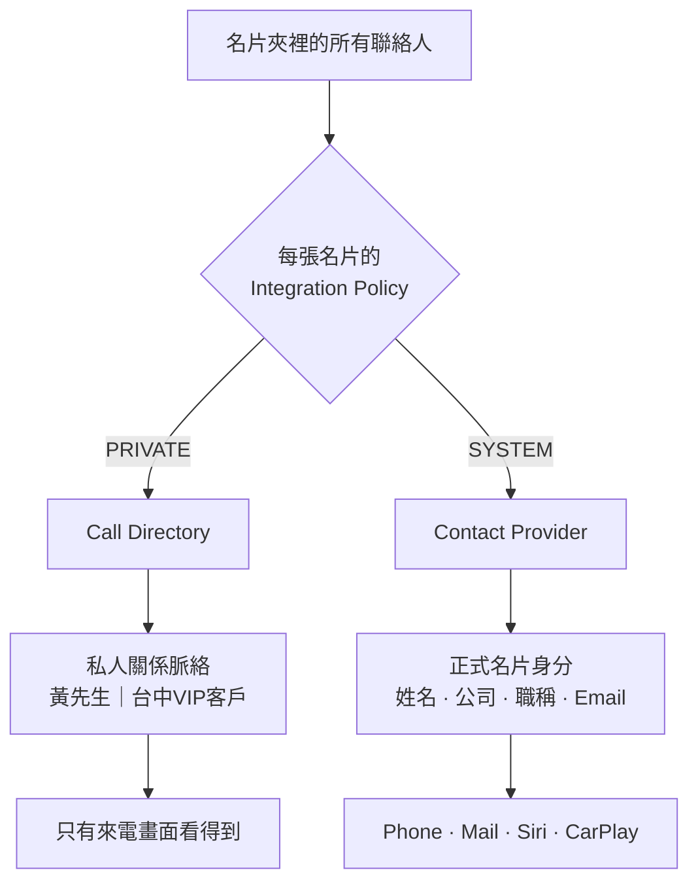

我最近在研究一個商務名片 App 的 iOS 來電辨識該怎麼做。需求講起來很單純:讓使用者接到電話時,畫面上那行字是由我們的 App 決定的。

查完文件會發現 Apple 給了三個看起來都能做這件事的 API,而大部分的介紹文章都是各自說明它們的用途。我一開始也是這樣理解的,把它們排成「三個層次」,以為可以依序疊加。

後來發現這個模型是錯的,而且錯得相當徹底。修正的過程比結論本身更值得寫,所以這篇不從 API 開始講。先看四通電話。

<!-- more -->

## 情境 A:十年老友

你手機裡存過一個號碼,備註寫「阿宏」。他打來,畫面顯示「阿宏」。

這裡沒有任何第三方 App 的事,但它是整件事最重要的一條規則:**使用者自己存過的東西,永遠優先。**

使用者在自己通訊錄裡寫的是「老婆」「老闆」「房東」「不要接」。這些不是不完整的資料,它們承載的是使用者自己的判斷。任何第三方服務跑來說「根據我的資料庫,這位是陳美玲女士」然後把「老婆」蓋掉,都是在破壞使用者對自己手機的控制權。

所以第一條界線先畫出來:這個 App 的目標不可能是「取代系統通訊錄」,只能是「在系統通訊錄答不出來的時候補上」。

## 情境 B:「黃先生｜台中VIP客戶」

這位黃先生在我的名片夾裡。他的名片上寫的是:

```
黃先生
某某科技
業務經理
0911111111
```

但我自己在 App 裡幫他加了一行備註:「台中VIP客戶」。

我希望他打來的時候,畫面上顯示的是「黃先生｜台中VIP客戶」,不是「黃先生｜某某科技｜業務經理」。

停下來看這行字的性質。「台中VIP客戶」**不是黃先生的身分**——他不會這樣自我介紹,他的名片上不會印這五個字。這是**我對他的認知**,是我跟他之間的商務關係。同一類的還有:

```
王小明｜XX專案主要窗口
李經理｜明年續約
陳小姐｜NFC供應商
吳先生｜老闆介紹的
```

這些東西我只想拿來辨識電話。我**不希望**它們跑進系統通訊錄——因為一旦進了系統通訊錄,任何取得通訊錄權限的 App 都看得到我對每個客戶的內部註記。那不是來電顯示,那是把 CRM 資料外洩。

這個需求對應的是 **Call Directory Extension**。

它的資料模型非常簡單:一組「電話號碼 → 標籤」的對應,事先交給系統,來電時直接比對。它不是在來電當下打 API 到你的伺服器,而是預先推送。

```
App 的名片夾
    │
    ▼
整理成 號碼 → 標籤
    │
    ▼
Call Directory Extension
    │
    ▼
系統保存這份辨識資料
    │
    ▼
來電時直接比對
```

而它有一個很少被提到、但在這個情境下至關重要的性質:**它是唯寫的**。

`CXCallDirectoryExtensionContext` 只有 `addIdentificationEntry` 跟 `removeIdentificationEntry`,沒有任何讀回資料的 API。你寫進去之後,連你自己的 App 都拿不回來,其他 App 更不可能。系統只在來電辨識流程裡使用這份資料。

所以 Call Directory 恰好是一個「私人關係脈絡投影到來電畫面」的輕量出口——資料出得去畫面,但出不去這個用途。

## 情境 C:天天寄信的客戶

陳大華是我每天都要打電話、寄信的合作對象。對他我的需求完全不同:

我希望 Phone、Mail、Siri、CarPlay 全部都認得他。我在 Mail 裡輸入「陳」就要跳出他,我對 Siri 說「打給陳大華」要打得通。

這不是來電顯示的需求,這是**聯絡人的需求**。

直覺的做法是把 App 的名片夾跟系統通訊錄做雙向同步,但這條路會炸開一堆問題:誰是 source of truth?使用者在系統通訊錄改了名字怎麼辦?App 端資料更新要不要覆蓋?兩邊刪除要不要連動?再加上要索取完整通訊錄權限、會碰到使用者的私人聯絡人、資料衝突,整個架構會複雜到不成比例。

**Contact Provider Extension** 走的是另一條路。它不是同步,是**提供**:

```
App(source of truth)
    │
    ▼
Contact Provider Extension
    │
    ▼
系統的 Contacts 生態
    │
    ▼
Phone / Mail / Siri / CarPlay ...
```

這些聯絡人會出現在系統的通訊錄生態裡,但不是被寫進使用者原本的通訊錄。你沒有去動使用者的媽媽、朋友、私人客戶,你是告訴系統「我這邊另外有這一批商務聯絡人,你可以拿去用」。資料的更新權仍然在你的 App,ownership 很乾淨。

實作上是 App 與 extension 透過 App Group 溝通,App 端用 `ContactProviderManager` 呼叫 `enable()` 與 `signalEnumerator()`,extension 端實作 `ContactItemEnumerator` 的 `enumerateContent(in:for:)`(初次同步)與 `enumerateChanges(startingAt:for:)`(增量同步)。注意它同樣是**預先推送**的模型,不是來電當下的即時查詢。

代價也很明確:進了 Contacts 生態,就是任何取得通訊錄權限的 App 都看得到。所以這裡放的只能是**正式名片上印得出來的資訊**。

## 情境 D:完全陌生的商務來電

最後一種:對方根本不在我的名片夾裡。我沒見過他,沒換過名片。

但他是這個名片網路的成員,他在上面建了自己的公開名片。理想的情況是:即使我從來沒有加過他,來電畫面上仍然能顯示他是誰。

這對應的是 **Live Caller ID Lookup**,而它底下用的是 **PIR(Private Information Retrieval)**。

<figure class="fig">
<svg id="fig-pir" viewBox="0 0 720 300" role="img" aria-label="PIR 查詢流程:來電號碼在裝置端就被加密,經過 Apple 的 OHTTP Relay 隱藏來源 IP,PIR Server 在看不懂查詢內容的情況下對加密資料集運算,加密結果回到裝置後才解密顯示。">
<style>
#fig-pir text { font-family: inherit; }
#fig-pir .box   { fill: var(--fig-card); stroke: var(--fig-line); stroke-width: 1; }
#fig-pir .lbl   { font-size: 13.5px; fill: var(--fig-text); }
#fig-pir .sub   { font-size: 11px; fill: var(--fig-muted); }
#fig-pir .zone  { font-size: 11px; fill: var(--fig-muted); letter-spacing: .5px; }
#fig-pir .flow  { stroke: var(--fig-line); stroke-width: 1.5; fill: none; }
#fig-pir .pkt      { animation: pirOut 6s infinite; }
#fig-pir .pkt-back { animation: pirBack 6s infinite; opacity: 0; }
#fig-pir .plain { animation: pirPlain 6s infinite; }
#fig-pir .ciph  { animation: pirCiph 6s infinite; opacity: 0; }
@keyframes pirOut  {
  0%        { transform: translateX(0);    opacity: 0; }
  5%, 10%   { transform: translateX(0);    opacity: 1; }
  25%       { transform: translateX(196px); opacity: 1; }
  42%, 52%  { transform: translateX(392px); opacity: 1; }
  56%, 100% { transform: translateX(392px); opacity: 0; }
}
@keyframes pirBack {
  0%, 56%   { transform: translateY(0) translateX(392px); opacity: 0; }
  60%       { transform: translateY(74px) translateX(392px); opacity: 1; }
  82%, 88%  { transform: translateY(74px) translateX(0); opacity: 1; }
  93%, 100% { transform: translateY(74px) translateX(0); opacity: 0; }
}
@keyframes pirPlain { 0%, 8% { opacity: 1; } 14%, 100% { opacity: 0; } }
@keyframes pirCiph  { 0%, 9% { opacity: 0; } 15%, 100% { opacity: 1; } }
</style>
  <text class="zone" x="24" y="20">裝置端</text>
  <text class="zone" x="286" y="20">Apple</text>
  <text class="zone" x="520" y="20">你的伺服器</text>
  <line x1="24" y1="28" x2="696" y2="28" stroke="var(--fig-line)" stroke-dasharray="2 5"/>
  <rect class="box" x="24" y="48" width="188" height="76" rx="8"/>
  <text class="lbl" x="44" y="74">Live Caller ID</text>
  <text class="lbl" x="44" y="92">Lookup Extension</text>
  <text class="sub" x="44" y="112">號碼在這裡就被加密</text>
  <rect class="box" x="266" y="48" width="188" height="76" rx="8"/>
  <text class="lbl" x="286" y="80">OHTTP Relay</text>
  <text class="sub" x="286" y="100">隱藏使用者 IP</text>
  <rect class="box" x="508" y="48" width="188" height="76" rx="8"/>
  <text class="lbl" x="528" y="74">PIR Server</text>
  <text class="sub" x="528" y="94">對加密資料集</text>
  <text class="sub" x="528" y="110">做同態運算</text>
  <path class="flow" d="M212 74 H266"/>
  <path class="flow" d="M454 74 H508"/>
  <path class="flow" d="M602 124 V158 H118 V124"/>
  <g class="pkt">
    <rect x="216" y="60" width="46" height="26" rx="13" fill="var(--fig-accent)" opacity=".16"/>
    <text class="plain" x="224" y="78" font-size="11" fill="var(--fig-accent)">09111</text>
    <text class="ciph"  x="228" y="78" font-size="11" fill="var(--fig-accent)">▓▓▓▓</text>
  </g>
  <g class="pkt-back">
    <rect x="216" y="60" width="46" height="26" rx="13" fill="var(--fig-accent)" opacity=".16"/>
    <text x="228" y="78" font-size="11" fill="var(--fig-accent)">▓▓▓▓</text>
  </g>
  <rect class="box" x="24" y="196" width="320" height="72" rx="8"/>
  <text class="lbl" x="44" y="222">裝置端解密 → 顯示在原生來電畫面</text>
  <text class="sub" x="44" y="246">只有這支 iPhone 看得到明文結果</text>
  <rect x="396" y="196" width="300" height="72" rx="8" fill="var(--fig-card-2)" stroke="var(--fig-line)" stroke-dasharray="5 4"/>
  <text class="lbl" x="416" y="220">伺服器知道的事</text>
  <text class="sub" x="416" y="240">✓ 有一個查詢進來了</text>
  <text class="sub" x="416" y="258">✗ 查誰、查到誰、誰在接電話</text>
</svg>
<figcaption>號碼在離開裝置之前就已加密,伺服器全程看不到查詢內容——你提供身分辨識能力,但拿不到「誰打給誰」。</figcaption>
</figure>

這裡的隱私性質值得講清楚:你的伺服器知道「有一個查詢進來了」,可以統計整體流量,但它**不知道這次查的是哪個號碼、查到了誰,也不知道是誰在接這通電話**。「某使用者今天 15:30 接到某某的電話」這種資料,在這個架構下你根本拿不到。

也就是:你提供身分辨識能力,但不掌握誰打給誰。

另外有個實作上的細節值得先知道:Apple 的來電身分並沒有獨立的「公司」與「職稱」欄位。所以實務上你多半是把姓名、公司、職稱組合成**單一顯示字串**丟回去,最後怎麼呈現在來電畫面上仍然由系統決定。

## 揭曉:這四個不是並列的功能

到這裡看起來很漂亮——四種情境,四個解法,各司其職。

我原本就是這樣規劃的,還幫它們編了號:第一層全域辨識、第二層名片夾辨識、第三層系統整合。三層疊加,涵蓋所有情境。

**這個模型是錯的。**

真實情況是,iOS 把這些資料來源排成一條**嚴格的階層**,而且**只取第一個命中的來源,後面全部短路**:

<figure class="fig">
<svg id="fig-chain" viewBox="0 0 720 392" role="img" aria-label="iOS 來電辨識的短路鏈:來電號碼依序查詢使用者 Contacts、Contact Provider、Call Directory、Live Caller ID Lookup,命中第一個來源後立即停止,其後的來源不會被呼叫。圖中的範例在第三層 Call Directory 命中。">
<style>
#fig-chain text { font-family: inherit; }
#fig-chain .card { fill: var(--fig-card); stroke: var(--fig-line); stroke-width: 1; }
#fig-chain .lbl  { font-size: 14px; fill: var(--fig-text); }
#fig-chain .sub  { font-size: 11.5px; fill: var(--fig-muted); }
#fig-chain .miss { font-size: 11px; fill: var(--fig-muted); }
#fig-chain .rail { stroke: var(--fig-line); stroke-width: 2; stroke-dasharray: 3 6; }
#fig-chain .out  { font-size: 12.5px; fill: var(--fig-muted); }
#fig-chain .row   { opacity: .45; }
#fig-chain .hit   { opacity: 1; }
#fig-chain .hit .card { stroke: var(--fig-accent); stroke-width: 2; }
#fig-chain .hit .lbl  { fill: var(--fig-accent); }
#fig-chain .scan  { animation: chainScan 7s infinite; }
#fig-chain .r1 { animation-delay: 0s; }
#fig-chain .r2 { animation-delay: .9s; }
#fig-chain .r3 { animation: chainHit 7s infinite; animation-delay: 1.8s; }
#fig-chain .dead { animation: chainDead 7s infinite; }
#fig-chain .token { animation: chainToken 7s infinite; }
#fig-chain .result { animation: chainResult 7s infinite; opacity: 0; }
@keyframes chainToken {
  0%              { transform: translateY(0);     opacity: 0; }
  4%, 11%         { transform: translateY(0);     opacity: 1; }
  17%, 24%        { transform: translateY(60px);  opacity: 1; }
  30%, 93%        { transform: translateY(120px); opacity: 1; }
  97%, 100%       { transform: translateY(120px); opacity: 0; }
}
@keyframes chainScan {
  0%, 3%          { opacity: .45; }
  6%, 12%         { opacity: 1; }
  16%, 100%       { opacity: .45; }
}
@keyframes chainHit {
  0%, 26%         { opacity: .45; }
  31%, 93%        { opacity: 1; }
  98%, 100%       { opacity: .45; }
}
@keyframes chainDead {
  0%, 30%         { opacity: .45; }
  36%, 93%        { opacity: .16; }
  98%, 100%       { opacity: .45; }
}
@keyframes chainResult {
  0%, 30%         { opacity: 0; }
  38%, 93%        { opacity: 1; }
  97%, 100%       { opacity: 0; }
}
</style>
  <rect x="76" y="8" width="230" height="32" rx="16" fill="var(--fig-card-2)" stroke="var(--fig-line)"/>
  <text class="lbl" x="96" y="29">來電  0911111111</text>
  <line class="rail" x1="52" y1="46" x2="52" y2="348"/>
  <g class="token">
    <circle cx="52" cy="84" r="7" fill="var(--fig-accent)"/>
    <circle cx="52" cy="84" r="12" fill="var(--fig-accent)" opacity=".18"/>
  </g>
  <g class="row scan r1">
    <rect class="card" x="76" y="62" width="286" height="44" rx="8"/>
    <text class="lbl" x="94" y="82">1 · 使用者自己的 Contacts</text>
    <text class="sub" x="94" y="98">「小明客戶」「老婆」「不要接」</text>
    <text class="miss" x="94" y="120">miss ↓</text>
  </g>
  <g class="row scan r2">
    <rect class="card" x="76" y="122" width="286" height="44" rx="8"/>
    <text class="lbl" x="94" y="142">2 · Contact Provider</text>
    <text class="sub" x="94" y="158">正式名片身分,進入 Contacts 生態</text>
    <text class="miss" x="94" y="180">miss ↓</text>
  </g>
  <g class="row r3">
    <rect class="card" x="76" y="182" width="286" height="44" rx="8"/>
    <text class="lbl" x="94" y="202">3 · Call Directory</text>
    <text class="sub" x="94" y="218">私人備註,只有來電畫面看得到</text>
  </g>
  <g class="result">
    <path d="M368 204 H392" stroke="var(--fig-accent)" stroke-width="2"/>
    <path d="M386 199 l7 5 -7 5" fill="none" stroke="var(--fig-accent)" stroke-width="2"/>
    <rect x="400" y="184" width="290" height="40" rx="8" fill="var(--fig-card)" stroke="var(--fig-accent)" stroke-width="2"/>
    <text class="lbl" x="418" y="209" fill="var(--fig-accent)">黃先生｜台中VIP客戶</text>
    <text class="out" x="400" y="243">命中 → 立即回傳,不再往下</text>
  </g>
  <g class="row dead">
    <rect class="card" x="76" y="242" width="286" height="44" rx="8" stroke-dasharray="5 4"/>
    <text class="lbl" x="94" y="262">4 · Live Caller ID Lookup</text>
    <text class="sub" x="94" y="278">PIR 全域查詢</text>
  </g>
  <g class="row dead">
    <rect class="card" x="76" y="302" width="286" height="44" rx="8" stroke-dasharray="5 4"/>
    <text class="lbl" x="94" y="322">5 · SIP header / 未知來電</text>
  </g>
  <g class="dead">
    <text class="out" x="400" y="290">← 這兩層完全不會被呼叫</text>
    <text class="out" x="400" y="310">即使它們有資料</text>
  </g>
</svg>
<figcaption>只有第一個命中的資料來源會被顯示。這個例子在第三層命中,第四、五層即使有答案也不會執行。</figcaption>
</figure>

Apple 的 DTS 工程師在開發者論壇上講得很直接:

> "No, we don't 'mix' data like this. There's basically a 'hierarchy' of data sources and we only present the data from that data source (whichever one 'works')."

理由也講得很清楚:使用者的聯絡人卡片優先,是因為那是使用者直接控制的東西,不該讓「陳美玲女士」蓋掉「老婆」;停在第一個命中也對效能有利;而混合多個來源的資料有被利用的可能,也會造成混淆。

(補充一句誠實的話:這條階層是依 Apple 官方說明整理的,Contact Provider 與 Call Directory 同時啟用時的實際行為我還沒有實機驗證過。)

## 這條短路鏈推翻了什麼

### 第一件事:我的層級編號是反的

我原本把 Contact Provider 當成「生態整合的加分項」排在最後,但它其實是**第三方能拿到的最高優先權來源**。

而 Live Caller ID Lookup 是我投入最重的一層——要自建 PIR 服務、OHTTP gateway、Privacy Pass token issuer,要做 DNS TXT 驗證、到 CloudKit Console 註冊、維護資料集重建管線——它卻在整條鏈的最底層,只有在前面四個來源全部落空時才會被呼叫到。

這不代表不該做,但它確實改變了投入順序的判斷。

### 第二件事:兩個模式不能同時開

這個比較嚴重。

假設黃先生同時存在 Contact Provider 的聯絡人裡,也存在 Call Directory 的對應表裡。依照短路規則,Contact Provider 贏。結果是:

<figure class="fig">
<svg id="fig-screens" viewBox="0 0 640 330" role="img" aria-label="兩種設定下的來電畫面對照:只啟用 Call Directory 時顯示「黃先生｜台中VIP客戶」;兩邊都啟用時 Contact Provider 短路取勝,私人備註消失,只剩「黃先生 某某科技」。">
<style>
#fig-screens text { font-family: inherit; }
#fig-screens .phone { fill: var(--fig-card-2); stroke: var(--fig-line); stroke-width: 1.5; }
#fig-screens .name  { font-size: 17px; fill: var(--fig-text); }
#fig-screens .meta  { font-size: 12.5px; fill: var(--fig-muted); }
#fig-screens .cap   { font-size: 12.5px; fill: var(--fig-muted); }
#fig-screens .good  { font-size: 12.5px; fill: var(--fig-accent); }
#fig-screens .src   { font-size: 10.5px; fill: var(--fig-muted); letter-spacing: .4px; }
#fig-screens .gone  { animation: screensGone 4.5s infinite; }
@keyframes screensGone {
  0%, 30%   { opacity: .9; }
  50%, 80%  { opacity: .12; }
  95%, 100% { opacity: .9; }
}
</style>
  <text class="cap" x="24" y="20">只啟用 Call Directory</text>
  <rect class="phone" x="24" y="34" width="258" height="212" rx="20"/>
  <rect x="120" y="46" width="66" height="7" rx="3.5" fill="var(--fig-line)"/>
  <circle cx="153" cy="96" r="21" fill="var(--fig-line)" opacity=".5"/>
  <text class="name" x="153" y="140" text-anchor="middle">黃先生｜台中VIP客戶</text>
  <text class="meta" x="153" y="162" text-anchor="middle">手機</text>
  <circle cx="106" cy="206" r="19" fill="var(--fig-muted)" opacity=".35"/>
  <circle cx="200" cy="206" r="19" fill="var(--fig-accent)" opacity=".8"/>
  <text class="good" x="24" y="272">我要的:自己的商務脈絡出現在來電畫面</text>
  <text class="src" x="24" y="292">來源 · Call Directory</text>
  <text class="cap" x="358" y="20">兩邊都啟用</text>
  <rect class="phone" x="358" y="34" width="258" height="212" rx="20"/>
  <rect x="454" y="46" width="66" height="7" rx="3.5" fill="var(--fig-line)"/>
  <circle cx="487" cy="96" r="21" fill="var(--fig-line)" opacity=".5"/>
  <text class="name" x="487" y="136" text-anchor="middle">黃先生</text>
  <text class="meta" x="487" y="157" text-anchor="middle">某某科技</text>
  <text class="meta gone" x="487" y="180" text-anchor="middle">台中VIP客戶</text>
  <circle cx="440" cy="206" r="19" fill="var(--fig-muted)" opacity=".35"/>
  <circle cx="534" cy="206" r="19" fill="var(--fig-accent)" opacity=".8"/>
  <text class="cap" x="358" y="272">Contact Provider 短路取勝,備註消失</text>
  <text class="src" x="358" y="292">來源 · Contact Provider</text>
</svg>
<figcaption>使用者打開看起來是升級的「系統整合」開關,換來的卻是來電畫面變得比原本更沒用——而且他不會知道原因。</figcaption>
</figure>

使用者打開一個看起來是升級的「系統整合」開關,換來的卻是來電畫面從「台中VIP客戶」退化成「黃先生」。他得到了 Mail 跟 Siri 的整合,但弄丟了他當初最想要的那個東西——而且他不會知道為什麼,他只會覺得「開了那個功能之後來電顯示變難用了」。

這不是邊緣案例,這是兩個開關都打開的預設路徑。

## 解法:讓每張名片自己決定

第一個念頭是做成全域二選一,讓使用者選一個模式。但這個解法不對——取捨應該按**聯絡人的性質**決定,而不是按使用者的性格決定。同一個人的名片夾裡,黃先生跟陳大華的需求本來就不一樣。

所以正確的做法是把 integration policy 下放到每一張名片:



黃先生設 PRIVATE,他的號碼只進 Call Directory,來電顯示「黃先生｜台中VIP客戶」,備註不外流。
陳大華設 SYSTEM,他的號碼只進 Contact Provider,Mail 跟 Siri 認得他,來電顯示用正式名片欄位。

而底層的規則可以寫成一條 invariant:

```
CallDirectoryNumbers  ∩  ContactProviderNumbers  =  ∅
```

**同一支電話號碼永遠只存在其中一邊。** 短路衝突從此不可能發生——因為兩邊本來就不重疊。

## 真正的收穫:Identity ≠ Relationship

寫下那條 invariant 之後,才看清楚它背後真正的東西。

這兩個 API 長得不一樣,不是 Apple 隨便設計的。它們餵的是**兩種不同性質的資料**:

| | Identity Data | Relationship Data |
|---|---|---|
| 內容 | 姓名、公司、職稱、電話、Email、頭像 | 私人備註、VIP 標記、專案、跟進狀態 |
| 回答的問題 | 這個人是誰 | 這個人跟我有什麼關係 |
| 擁有者 | 這個人自己 | 我 |
| 出口 | Contact Provider | Call Directory 的 label |
| 可見範圍 | 系統 Contacts 生態 | 只有來電畫面 |

有一個很誘人的 workaround:把 Contact Provider 的姓名欄位直接設成「黃先生｜台中VIP客戶」。技術上大概可行,而且一次解決所有問題。

但這件事應該被明確禁止。因為那等於為了來電顯示,把內部的 CRM 脈絡擴散到系統 Contacts 生態,擴散到每一個取得通訊錄權限的 App。Contact Provider 的定位是把 App 管理的**聯絡人**提供給系統,不是提供你的內部註記。

而這條邊界反過來把產品定義得更清楚了:這個 App 要保存的不只是「這個人是誰」,更是「這個人跟我有什麼商務關係」。前者名片本身就有,後者才是名片夾存在的理由。

一個被 Apple 的優先權設計逼出來的領域邊界,比憑空想出來的漂亮。

## 從 invariant 掉出來的工程約束

定了 invariant 之後,有幾件事變成必須處理的:

**模式切換是兩條獨立的非同步管線。** 把一張名片從 PRIVATE 換成 SYSTEM,要做兩件事:從 Call Directory 移除(增量移除 + `reloadExtension`),以及加進 Contact Provider 的同步(App Group + `ContactProviderManager`)。這是兩套各自會失敗的機制,中間存在一個窗口。

所以寫入順序不能隨便定。兩種失敗模式的後果完全不同:

```
兩邊都有   →  Contact Provider 短路取勝,結果仍然確定,只是暫時少了備註
兩邊都沒有 →  來電畫面空白,什麼都不顯示
```

結論很明確:**先加進新集合,再從舊集合移除。** 讓失敗落在「兩邊都有」那一側。

**invariant 是 per-number 而非 per-card。** 一個人可能有多支號碼;更麻煩的是兩張不同的名片可能共用同一支公司總機。如果王小明是 SYSTEM、黃先生是 PRIVATE,而兩人的名片上都寫了同一個總機號碼,交集就破了。這需要一條仲裁規則。

**Call Directory 的資料格式限制比想像中嚴格。** 號碼必須是 E.164 格式的 64 位元整數,而且**必須遞增排序**——沒排序不是漏掉幾筆,是整個 extension 失效。台灣號碼要正規化成 +886 並去掉前導的 0。分機號碼沒有辦法表示。一個號碼也只能對應一個標籤。

## UI:不要讓使用者看到 Apple 的名詞

最後一件事。這個取捨必須讓使用者看得懂,但沒有人需要知道什麼是 Call Directory。

所以介面上不要出現 API 名稱,而是直接講清楚他換到了什麼、失去了什麼:

```
○  僅在此 App 管理
   只有這個 App 管理這位聯絡人。
   來電時可以顯示您的私人備註。

   來電畫面: 黃先生｜台中VIP客戶


○  提供給 iPhone 系統使用
   將這位聯絡人提供給 iPhone 系統。
   Phone、Mail 等功能可以辨識他,
   但來電將使用正式名片資訊,不顯示私人備註。

   來電畫面: 黃先生  某某科技
```

把兩邊的來電畫面直接畫出來,使用者一眼就知道自己在選什麼。這比任何文字說明都有效。

## 小結

這趟研究真正的收穫不是「學會了三個 API」,而是三件事:

1. **這三個 API 不是三個並列的功能,是一條有優先權的短路鏈。** 沒認清這件事之前,我的架構圖的層級編號跟實際優先權剛好是反的。
2. **Call Directory 與 Contact Provider 的差異是「隱私範圍」,不是「精緻度」。** 一個唯寫、只有來電畫面看得到;一個進入整個 Contacts 生態。用錯了就是資料外洩。
3. **真正的設計工作不在「接哪個 API」,而在「哪些資料屬於 Identity、哪些屬於 Relationship」。** 這條邊界一旦劃清楚,API 的選擇就是自動的,連 invariant 都是自動的。

還沒有寫進來的是另一整塊:全域資料集的成員資格該怎麼定、號碼所有權要怎麼驗證、PIR 在保護查詢者的同時讓伺服器失去了哪些防濫用能力、以及資料刪除的生效時間。那些問題的性質跟這篇不一樣,留到下一篇再談。

### 延伸閱讀

- [Does Live Caller ID Lookup entirely replace Call SIP content, or are they ever combined?](https://developer.apple.com/forums/thread/762645) — Apple DTS 對資料來源階層的說明,本文短路鏈的主要依據
- [apple/pir-service-example](https://github.com/apple/pir-service-example) — Live Caller ID Lookup 的 PIR 服務範例與上線文件
- [Understanding how Live Caller ID Lookup preserves privacy](https://developer.apple.com/documentation/identitylookup/understanding-how-live-caller-id-lookup-preserves-privacy) — PIR 與 OHTTP 的隱私模型
- [CXCallDirectoryExtensionContext](https://developer.apple.com/documentation/callkit/cxcalldirectoryextensioncontext) — Call Directory 的 API 介面(注意沒有讀取方法)
- [ContactProviderExtension](https://developer.apple.com/documentation/contactprovider/contactproviderextension/) — Contact Provider 的擴充點與同步模型
