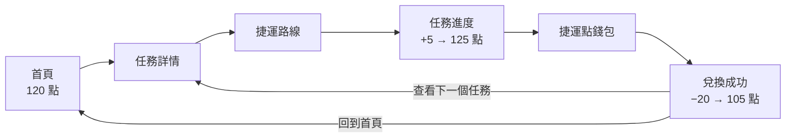

> 台北捷運任務點數平台 — 搭捷運、做任務、累點數、換好禮

今年我跟隊友組隊參加了一場黑客松，題目圍繞台北捷運的「捷運點」。我們提的是「玩點任務地圖」（MapGo）：搭捷運去指定商圈完成任務、累積捷運點，再拿點數兌換合作店家的優惠。這個 prototype 是我一個人做的。

它是一個 prototype：沒有後端、沒有真的點數，優惠跟兌換碼也都是示意。所以這篇不談點子本身，而是談一件更實際的事：**一個要拿去現場 demo 的 prototype，要怎麼設計才不會在台上出錯。**

<!-- more -->

## 先問：這個 prototype 會在什麼情況下被使用

開發前我整理了三份規劃文件：Project Brief、UI/UX Specification、Frontend Architecture，都放在 repo 的 `uploads/` 裡。Frontend Architecture 的第一段就把前提講清楚了：

> 它的核心目標不是建立正式上線系統，而是在 2–3 分鐘 Demo 中完整展示：
>
> **推薦任務 → 任務詳情 → 捷運路線 → 模擬到站 → 完成任務 → 捷運點入帳 → 優惠兌換 → 下一任務推薦**
>
> 官方參賽文件要求企劃書包含「技術可行性」與「產品或服務雛型設計圖」，且提案企劃書最多 5 頁 PDF，因此本前端架構必須優先服務 **穩定展示、易截圖、離線可跑、工程範圍可控**。

也就是說，這個 prototype 只有兩個使用場合：現場 2–3 分鐘的 demo，以及企劃書裡的截圖。**穩定展示、易截圖、離線可跑、工程範圍可控**這四個詞，決定了後面所有的技術選擇。

## 一條主線，六個畫面

整個 demo 是一條固定的路徑，點數怎麼變化也是事先排好的：




<p style="font-size:13px;color:#888;text-align:center;margin-top:-10px;">在瀏覽器以手機尺寸執行 repo 內的 <code>dist/</code> 截圖。</p>

首頁有三張任務卡，但只有「中山甜點散步線」點得進去，另外兩張會跳出「即將上線」的提示：

```tsx
// src/screens/ScreenHome.tsx
  const handleCardSelect = (m: Mission) => {
    if (m.highlighted) {
      go('detail');
    } else {
      showToast(`「${m.title}」即將上線，敬請期待！`);
    }
  };
```

看起來像偷懶，其實是刻意的：**demo 只有一條路，台上就不會有人點進還沒做完的畫面。** 首頁仍然看得出「任務有很多種」，但能走的只有準備好的那一條。

## 不用 router，用一個畫面狀態機

六個畫面、一條路徑、不需要網址，所以我沒有用 React Router，而是在 `App.tsx` 用一個 state 決定現在顯示哪個畫面：

```tsx
// src/App.tsx
const SCREEN_MAP: Record<Screen, (props: { ctx: AppContext }) => JSX.Element> = {
  home: ScreenHome,
  detail: ScreenDetail,
  route: ScreenRoute,
  progress: ScreenProgress,
  wallet: ScreenWallet,
  success: ScreenSuccess,
};

export default function App() {
  const [screen, setScreen] = useState<Screen>('home');
  const [balance, setBalance] = useState(120);
  const [missionStatus, setMissionStatus] = useState<MissionStatus>('not-started');

  const navigate = (s: Screen) => {
    window.scrollTo({ top: 0, behavior: 'instant' });
    setScreen(s);
  };
```

目前在哪個畫面、點數餘額、任務狀態，全部集中在 `App` 這一層，再透過 `ctx` 傳給每個畫面。畫面本身不存任何狀態，只負責顯示跟呼叫 `go()`。

集中管理最大的好處，是**可以一次把 demo 重置**：

```tsx
// src/App.tsx
  useEffect(() => {
    if (screen === 'success' && balance === 125) setBalance(105);
    if (screen === 'home' && balance !== 120) {
      setBalance(120);
      setMissionStatus('not-started');
    }
    if (screen === 'progress' && missionStatus === 'not-started') {
      setMissionStatus('started');
    }
  // eslint-disable-next-line react-hooks/exhaustive-deps
  }, [screen]);
```

只要回到首頁，點數就回到 120、任務回到「未開始」。實際走完一輪再按「回到首頁」，第二輪確實又從頭開始。現場 demo 完一次，下一位評審想再看，直接從首頁重來就好，不用重新整理頁面，也不會出現「點數已經被扣過了」的尷尬狀況。

## 用一個按鈕取代 GPS

正式產品要驗證「使用者真的到了中山站」，勢必要用定位。功能清單裡也把「GPS 位置驗證（Geolocation API）」列為之後要做的項目。但 demo 現場在室內，也不在中山站，定位只會變成一個不確定因素。

所以任務進度畫面用的是一個小狀態機，由按鈕推進：

```tsx
// src/screens/ScreenProgress.tsx
  if (missionStatus === 'started') {
    cta = '模擬抵達中山站';
    ctaAction = () => setMissionStatus('arrived');
  } else if (missionStatus === 'arrived') {
    cta = '完成商圈探索';
    ctaAction = () => { setMissionStatus('completed'); earn(); };
  } else {
    cta = '查看捷運點錢包';
    ctaAction = () => go('wallet');
  }
```

`started` →（模擬抵達）→ `arrived` →（完成探索，+5 點）→ `completed`。同一個按鈕位置，文字跟動作隨狀態改變，講者只要一直按同一個地方，流程就會往前走。畫面上也直接標明「Prototype 模擬，非真實 GPS 驗證」，不假裝這是真的定位。


## 讓網路沒辦法搞砸 demo

黑客松現場最不可控的就是網路。這個 prototype 的做法是：**根本不連網。**

所有任務、路線、優惠資料都寫在 `src/data/index.ts` 裡，例如捷運路線：

```ts
// src/data/index.ts
export const ROUTE: RouteData = {
  source: 'TDX 捷運公開資料示意',
  line: '淡水信義線',
  lineColor: '#E3262F',
  from: '台北車站',
  to: '中山站',
  fromCode: 'R10 / BL12',
  toCode: 'R11 / G14',
  fromSub: '淡水信義線 ⇆ 板南線',
  toSub: '建議出口：中山站 4 號出口',
  estimatedRideTime: 2,
  direction: '往淡水 / 北投方向',
};
```

沒有 API 呼叫，就沒有 API 失敗。再用 `vite-plugin-pwa` 把整個 App 預先快取起來：

```ts
// vite.config.ts
    VitePWA({
      registerType: 'autoUpdate',
      includeAssets: ['icon-192.svg', 'icon-512.svg'],
      workbox: {
        globPatterns: ['**/*.{js,css,html,svg,json}'],
        runtimeCaching: [
          {
            urlPattern: /^https:\/\/tdx\.transportdata\.tw\/.*/i,
            handler: 'NetworkFirst',
            options: {
              cacheName: 'tdx-api-cache',
              expiration: { maxEntries: 20, maxAgeSeconds: 60 * 60 * 24 },
              networkTimeoutSeconds: 5,
            },
          },
        ],
      },
```

建置出來的 Service Worker 會預先快取 8 個檔案：`index.html`、JS、CSS、兩個 icon、兩份 manifest，以及負責註冊 Service Worker 的 `registerSW.js`，也就是整個 App。只要事先開過一次，之後就算完全離線也能打開。

這一點實際測過。功能清單原本把「離線功能完整測試（Chrome DevTools Offline 模擬）」列為待建項目，寫這篇時補做了：先正常開一次讓 Service Worker 裝好，再用 Chrome DevTools 切成離線、重新開啟頁面，此時連一般的 `fetch` 都會失敗，但從首頁一路到「兌換成功」整條流程都能走完。

測試時也踩到一個值得記下來的坑：**離線時如果用強制重新整理（Ctrl + Shift + R），瀏覽器會繞過 Service Worker**，畫面直接變成斷線頁。所以 demo 前要先正常開過一次，現場也不要按強制重新整理。

### 關於 TDX

路線畫面上標的是「捷運站點資料示意」。repo 裡其實有一份從 TDX（交通部運輸資料流通服務）`/v3/Rail/Metro/StationOfRoute/TRTC` 抓下來的站序快取 `tdx-cache.json`，上面的設定裡也有一條針對 `tdx.transportdata.tw` 的 `NetworkFirst` 規則：網路 5 秒內沒回應，就改用快取。這是準備接真實資料時的備援設計。

但這一版沒有任何地方讀取這份快取，也沒有呼叫 TDX API，路線資料是寫死的。換句話說，真正讓這個 demo 不怕斷網的，不是 fallback，而是**它從頭到尾都不需要網路**。接上 TDX 的即時資料，是這個 prototype 還沒做的下一步。

## 範圍：149 項功能裡只做 32 項

最後一份文件是 `docs/PRODUCT_FEATURES.md`。我用產品負責人（PO）的角度，把所有想得到的功能列成清單，再分成三級：

| 標示 | 意思 | 項目數 |
|---|---|---|
| 🟢 | 已實作 | 32 |
| 🔵 | 高價值、之後要做 | 83 |
| ⚪ | 未來再考慮 | 34 |

登入、排行榜、好友、成就、推播、真實 GPS 驗證……都在 🔵 跟 ⚪ 裡。🟢 的 32 項，是 demo 主線會經過的那幾個畫面，加上讓它能穩定展示的 PWA、轉場動畫跟可讀性細節。這就是「工程範圍可控」的實際樣子：**不是做得少，而是清楚知道哪些不做。**

## 小結

1. **先問 prototype 會在什麼場合被使用。** 3 分鐘的 demo 加上 5 頁的 PDF，直接決定了「穩定、易截圖、離線、範圍可控」這四個優先順序。
2. **把不確定性換成確定性。** 定位換成按鈕、API 換成寫死的資料、網路換成預先快取。每拿掉一個外部依賴，台上就少一個可能出錯的地方。
3. **狀態集中，demo 才能重來。** 畫面、點數、任務狀態都在同一層，回到首頁就能一次重置，同一個流程可以重複展示。

### 延伸閱讀

- [reedlin2002/MapGo](https://github.com/reedlin2002/MapGo) — 本文程式碼與規劃文件的出處
- [Vite PWA](https://vite-pwa-org.netlify.app/) — `vite-plugin-pwa` 官方文件
- [Workbox strategies](https://developer.chrome.com/docs/workbox/modules/workbox-strategies) — `NetworkFirst` 等快取策略的說明
