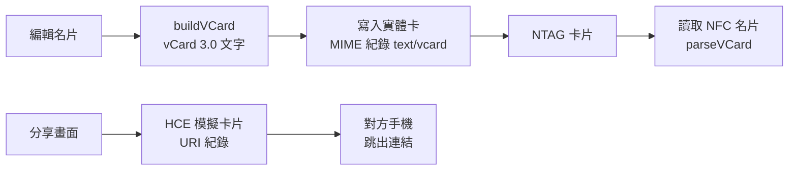
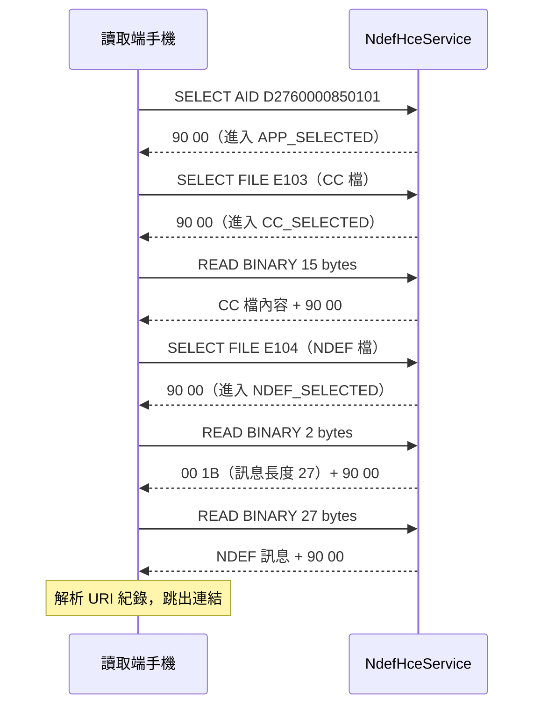

交換名片最麻煩的一步，是讓對方「拿到」你的資訊：傳 LINE 要先加好友，掃 QR code 要先打開相機。我想要的是兩支手機碰一下，對方手機就跳出我的連結，而且對方**不需要安裝任何 App**。

工作上的產品後來也要做 NFC 功能，但需求還沒定型，不適合直接在正式專案裡試。所以我先開了一個獨立的 prototype：NFC-test。它是用 React + Capacitor 包成原生 App 的 NFC 名片工具，驗證三件事：手機對手機分享、寫入實體 NFC 卡、讀取別人的 NFC 名片。

這篇的重點是第一件事：**怎麼讓一支 Android 手機，假裝成一張 NFC 卡片。**

<!-- more -->

## 三個功能，兩種資料格式


<p style="font-size:13px;color:#888;text-align:center;margin-top:-10px;">在瀏覽器執行 repo 內建置好的 <code>dist/</code> 截圖。NFC 只能在原生 App 使用，所以分享頁顯示的是瀏覽器模式的提示；範例名片資料為虛構。</p>

App 裡有兩條路徑，用的是兩種不同的 NDEF 紀錄（NFC 上交換資料的標準格式）：



為什麼要分兩種？看的是**接收的人有沒有這個 App**：

- **手機對手機**：對方沒裝 App，能確定被正確處理的只有網址。所以送的是 URI 紀錄，對方手機會把它當成一般連結打開。
- **實體卡**：卡片要放的是整張名片，所以寫的是 MIME 類型 `text/vcard` 的紀錄。這個 App 也在 `AndroidManifest.xml` 註冊了 `text/vcard` 的 `NDEF_DISCOVERED`，感應到 vCard 卡片時會直接開啟 App 來讀。

## 手機怎麼假裝成一張卡片

另一支手機在讀 NFC 卡片時，其實不知道、也不在乎對面是不是真的卡片。它只會照 **NFC Forum Type 4 Tag** 的規格，一問一答地送出 APDU 指令（ISO/IEC 7816-4 定義的指令格式）。只要照規格回答，讀取端就會把它當成一張卡。

Android 提供的入口是 `HostApduService`，這種做法叫 HCE（Host Card Emulation）。首先要在設定檔裡註冊一個 AID：

```xml
<!-- android/app/src/main/res/xml/apduservice.xml -->
    <aid-group
        android:description="@string/app_name"
        android:category="other">
        <!-- NDEF Tag Application AID (NFC Forum Type 4 Tag) -->
        <aid-filter android:name="D2760000850101"/>
    </aid-group>
```

`D2760000850101` 是 NFC Forum 定義的「NDEF Tag Application」識別碼。讀取端遇到 Type 4 Tag，第一個動作就是「選擇這個 AID」；Android 看到之後，會把接下來的指令全部轉給這個服務。依 Type 4 Tag 規格，一次讀取大致是這樣：



### 兩種指令、四個狀態

`NdefHceService` 本身就是一個很小的狀態機。它只處理兩種指令：SELECT（`A4`）跟 READ BINARY（`B0`），其他一律回「不支援」：

```java
// android/.../NdefHceService.java
    @Override
    public byte[] processCommandApdu(byte[] apdu, Bundle extras) {
        if (apdu == null || apdu.length < 4) return SW_UNKNOWN;
        Log.d(TAG, "← " + hex(apdu));

        int ins = apdu[1] & 0xFF;

        // SELECT (INS = A4)
        if (ins == 0xA4) return handleSelect(apdu);

        // READ BINARY (INS = B0)
        if (ins == 0xB0) return handleReadBinary(apdu);

        return SW_UNKNOWN;
    }
```

SELECT 決定「現在選到哪個檔案」，把狀態從 `NONE` 推進到 `APP_SELECTED`，再到 `CC_SELECTED` 或 `NDEF_SELECTED`。READ BINARY 則依狀態回傳對應檔案的一段內容，最後補上 `90 00`（成功）：

```java
// android/.../NdefHceService.java
    private byte[] handleReadBinary(byte[] apdu) {
        if (apdu.length < 5) return SW_UNKNOWN;

        int offset = ((apdu[2] & 0xFF) << 8) | (apdu[3] & 0xFF);
        int length = apdu[4] & 0xFF;

        byte[] file;
        if (state == State.CC_SELECTED)   file = ccFile;
        else if (state == State.NDEF_SELECTED) file = ndefFile;
        else return SW_NOT_FOUND;

        if (offset >= file.length) return SW_NOT_FOUND;

        int end  = Math.min(offset + length, file.length);
        byte[] chunk = Arrays.copyOfRange(file, offset, end);
        byte[] resp  = new byte[chunk.length + 2];
        System.arraycopy(chunk, 0, resp, 0, chunk.length);
        resp[chunk.length]     = (byte)0x90;
        resp[chunk.length + 1] = (byte)0x00;
        Log.d(TAG, "→ " + chunk.length + " bytes");
        return resp;
    }
```

感應結束時，系統呼叫 `onDeactivated`，狀態回到 `NONE`，下一次感應從頭開始。

### 兩個檔案：CC 跟 NDEF

讀取端會讀兩個「檔案」，但它們其實只是服務裡的兩個 byte 陣列。

**CC 檔（Capability Container）** 是卡片的自我介紹：NDEF 檔的 ID 是 `E104`、最大多大、一次最多能讀幾個 bytes：

```java
// android/.../NdefHceService.java
            ccFile = new byte[]{
                0x00, 0x0F,                                         // CC length
                0x20,                                               // Mapping v2.0
                0x00, 0x3B,                                         // Max R-APDU data size
                0x00, 0x34,                                         // Max C-APDU data size
                0x04,                                               // NDEF File Control TLV tag
                0x06,                                               // TLV length
                (byte)0xE1, (byte)0x04,                            // NDEF File ID
                (byte)(maxSize >> 8), (byte)(maxSize & 0xFF),      // Max NDEF file size
                0x00,                                               // Read access: open
                0x00                                                // Write access: open
            };
```

**NDEF 檔**則是「2 bytes 的長度 + 訊息本體」。訊息用 Android 內建的 `NdefRecord.createUri` 產生：

```java
// android/.../NdefHceService.java
            // Build NDEF message bytes
            NdefRecord uriRecord = NdefRecord.createUri(currentUrl);
            NdefMessage msg = new NdefMessage(uriRecord);
            byte[] msgBytes = msg.toByteArray();
            int msgLen = msgBytes.length;

            // NDEF file = 2-byte length + message
            ndefFile = new byte[2 + msgLen];
            ndefFile[0] = (byte)(msgLen >> 8);
            ndefFile[1] = (byte)(msgLen & 0xFF);
            System.arraycopy(msgBytes, 0, ndefFile, 2, msgLen);
```

以程式預設分享的 `https://reedlin2002.github.io/` 來算，整個訊息只有 27 bytes：

```text
D1 01 17 55 04 72 65 65 64 6C 69 6E ...
│  │  │  │  │  └ "reedlin2002.github.io/"（22 bytes）
│  │  │  │  └ URI 前綴碼 0x04，代表 "https://"
│  │  │  └ 類型 'U'（URI）
│  │  └ 內容長度 0x17 = 23
│  └ 類型長度 1
└ MB | ME | SR | TNF=1（NFC Forum 標準類型）
```

`https://` 被壓成一個 byte 的前綴碼，這是 URI 紀錄的標準做法。CC 檔宣告單次最多回傳 `0x3B` = 59 bytes，所以 27 bytes 的訊息一次 READ BINARY 就讀完了。

## App 端：從按鈕到服務

React 這一側看不到 Java。中間靠的是一個自己寫的 Capacitor plugin，只有 `start` 跟 `stop` 兩個方法：

```java
// android/.../NfcHcePlugin.java
    @PluginMethod
    public void start(PluginCall call) {
        String url = call.getString("url", NdefHceService.DEFAULT_URL);
        Intent intent = new Intent(getContext(), NdefHceService.class);
        intent.putExtra("url", url);
        getContext().startService(intent);
        call.resolve();
    }
```

服務在 `onStartCommand` 收到網址後，存進 `static` 的 `currentUrl`，再建好 CC 跟 NDEF 兩個檔案：

```java
// android/.../NdefHceService.java
    @Override
    public int onStartCommand(android.content.Intent intent, int flags, int startId) {
        if (intent != null && intent.hasExtra("url")) {
            currentUrl = intent.getStringExtra("url");
        }
        buildFiles();
        return android.app.Service.START_STICKY;
    }
```

前端則用一個 hook，讓「模擬卡片」只在分享畫面開著的時候啟動，離開畫面就停止：

```ts
// src/hooks/useNfcHce.ts
  useEffect(() => {
    startHce()
    return () => {
      stopHce()
    }
  }, [])
```

整條路徑是：分享畫面掛載 → `NfcHce.start({ url })` → `startService` 帶著網址 → `onStartCommand` 建檔 → 等待讀取端靠近。畫面上的使用說明也寫著「保持此畫面開啟，手機螢幕亮著」。

## 實體卡：容量與感應中斷

寫入實體卡走的是另一條路。名片先組成 vCard 3.0 文字，再包成 MIME 紀錄：

```ts
// src/utils/ndefEncoder.ts
export function buildNdefRecord(card: BusinessCard): NdefRecord {
  const encoder = new TextEncoder()
  return {
    tnf: 0x02,
    type: Array.from(encoder.encode('text/vcard')),
    id: [],
    payload: Array.from(encoder.encode(buildVCard(card))),
  }
}
```

`tnf: 0x02` 代表「類型欄位是 MIME 類型」。容量在這裡變成實際的限制：上面截圖裡那張範例名片，vCard 文字是 208 bytes，寫進卡片後約佔 224 bytes。常見的 NTAG213 使用者記憶體只有 144 bytes，根本放不下；NTAG215（504 bytes）跟 NTAG216（888 bytes）才夠。所以寫入畫面上直接提示「建議使用 NTAG215 或 NTAG216 標籤」。

實機測試實體卡時，我碰過 `tagConnectionLost`，也就是感應到一半連線斷了。常見的原因是卡片離開感應範圍太快，或擺放位置不穩，寫入還沒完成就中斷。這個問題的解法不在程式邏輯裡，而是在操作上：**讓卡片在感應區多停留一下**，穩定度就明顯變好。所以寫入中的提示文字直接寫成：

```tsx
// src/screens/WriteScreen.tsx
                  label={
                    status === 'writing'
                      ? '正在寫入，請勿移開手機…'
                      : '請將手機靠近 NFC 標籤卡片'
                  }
```

失敗時畫面會顯示錯誤訊息，並保留一個「重試」按鈕，不用退出重來。

## 平台不對稱：為什麼 iPhone 只能收

這個 prototype 最重要的產出，其實是下面這張表：

| 能力 | Android | iPhone |
|---|---|---|
| 模擬卡片（發送方） | 可以，`HostApduService`（已實測） | 一般 App 不行，卡片模擬需要 Apple 的特別授權 |
| 讀取模擬出來的卡片（接收方） | 可以（已實測 Android → Android） | 理論上可以，它看起來就是一張 Type 4 Tag（**未實測**） |
| 讀寫實體 NTAG 卡 | 可以（已實測） | 需要付費 Apple Developer 帳號（**未實測**） |

手機對手機分享，只有「Android 發送」這個方向走得通。如果把它當成主要功能，所有用 iPhone 的人都發不出名片。相較之下，實體卡是兩個平台都能讀的媒介。

這也是後來正式產品把實體 NFC 卡當成主要媒介的原因：**平台限制要在 prototype 階段就驗出來，它會直接決定產品往哪裡走。**

## 回頭看：還沒處理的地方

1. **分享的網址是寫死的。** `ShareScreen.tsx` 裡的 `SHARE_URL` 固定是部落格首頁，還沒有跟編輯好的名片資料接起來。
2. **停止服務，不等於關掉模擬。** Android 官方文件寫得很清楚：「tapping the device against the NFC reader starts the correct service if it is not already running」。AID 是寫在 manifest 裡的靜態註冊，所以就算離開分享畫面、呼叫了 `stopService`，只要螢幕亮著，手機靠近讀取端時系統還是會重新啟動這個服務。更麻煩的是，這條路徑不會經過 `onStartCommand`，CC 檔還沒建好，讀取端一讀 CC 檔就會遇到空值。這是回頭讀程式時發現的，**還沒在實機上重現**。比較穩的改法是在 `onCreate` 就建好檔案，並用 `PackageManager.setComponentEnabledSetting` 真正啟用、停用這個服務元件。
3. **vCard 還很粗糙。** 顯示名稱照 `firstName lastName` 組字串，所以截圖裡變成「小明 王」；欄位裡的逗號跟分號，也沒有照 vCard 規格做跳脫。

## 小結

1. **HCE 的本質是「照規格回答問題」。** 讀取端只看 APDU，不知道對面是一支手機。整個服務就是一個兩種指令、四個狀態的狀態機，加上兩個 byte 陣列。
2. **資料格式看接收方決定。** 對方沒有 App，就只能給網址；要傳完整名片，就要讓讀取端認得 vCard，還得先算清楚卡片裝不裝得下。
3. **平台不對稱要早點驗。** 「iPhone 不能發送」這一件事，就決定了正式產品要走實體卡。

### 延伸閱讀

- [reedlin2002/NFC-test](https://github.com/reedlin2002/NFC-test) — 本文程式碼的出處
- [Host-based card emulation overview](https://developer.android.com/develop/connectivity/nfc/hce) — Android 官方的 HCE 說明，包含 AID 路由與服務啟動方式
- [Cap-go/capacitor-nfc](https://github.com/Cap-go/capacitor-nfc) — 讀寫實體 NFC 標籤用的 Capacitor plugin

> 更新紀錄：2026-09-28 依 repo 的實際程式碼重寫。前一版描述的是 Web NFC API 的用法，與這個 repo 的實作（Capacitor + Android HCE）不符。
