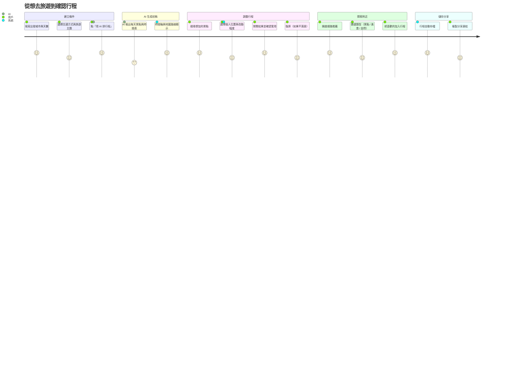
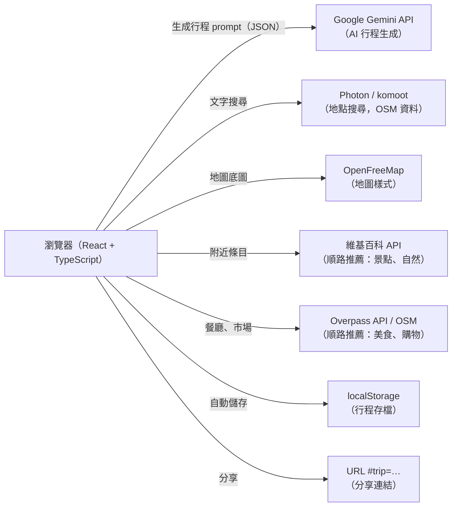

# 智慧旅程規劃：AI 排初稿，在地圖上隨時加景點

> 五月那篇〈[用 AI 幫你規劃旅程](/2026/05/16/travel-planner-side-project/)〉記錄了 v0.1 的開發過程。這次是完整的重做——UI、資料模型、規劃邏輯全部砍掉重來。這篇不談程式細節，而是從「這個平台要解決什麼問題、用戶需要什麼、每個功能怎麼回應那個需求」的角度來寫。

---

## 問題是什麼

在計畫旅遊的時候，大部分的時間其實不是花在旅遊本身，而是在回答這三個問題：

1. **去哪裡？** — 景點這麼多，哪些值得去？要怎麼篩選？
2. **怎麼排？** — 景點彼此距離不同，路線怎麼走最不繞？
3. **幾點到？** — 每個地方要留多久、什麼時候出發才不會太趕？

這些問題互相牽連：改了景點順序，時間就全部跑掉；想臨時加一個景點，又要從頭重排。結果很多人花了幾個小時做規劃，精力耗盡，出發前就已經很累了。

**目標使用者**：忙碌的上班族（時間有限、不想從零開始）與深度旅行者（想要精心安排但不想手動排序計算時間）。

---

## V0.1 的需求，現在怎麼實現

五月版本的 PRD（V0.1）定義了六個核心需求，以下對照現在的實作：

| 需求 | PRD 原文 | 現在的做法 |
|------|----------|-----------|
| A-1 | 輸入起點與終點 | 出發城市（必填）＋結束城市（選填）；不填終點時 AI 以起點為中心輻射式探索 |
| A-2 | 天數 1–7 天、人數 1–10 人 | 調整為 1–14 天、1–20 人（實際使用反映需求更長更大） |
| A-3 | 三種交通方式 | 大眾運輸、步行、開車，加上旅遊主題（歷史文化／自然風景／在地美食／購物／休閒放鬆／戶外活動）讓 AI 排的景點更符合偏好 |
| A-4 | AI 生成帶時間的行程 | 每站含到達時間、建議停留時長；各段標「估算」（直線距離 × 1.25） |
| B-1 | 左面板行程表、右邊地圖 | 桌機維持此版型；手機改為底部面板＋分頁列 |
| B-2 | 地圖上依順序連線 | 當天路線用深青色實線、其他天用灰色淡線；圖例在右下角 |

一個改動值得特別說：原本想用 Google Maps，後來改成 **MapLibre GL + OpenFreeMap**——免費、免 API 金鑰、不限次數，對 Side Project 來說負擔少很多。地點搜尋同樣用開放資料（Photon / komoot，資料來自 OpenStreetMap）。

<!-- more -->

---

## 重新定義的核心需求：AI 只是起點

v0.1 的問題在於：AI 排完就結束了。但真實的旅遊規劃不是這樣——你會途中看到一個想去的地方、朋友推薦一個餐廳、發現原本的安排太趕或太閒。**AI 排的是初稿，人來做最後的決定**。

這一版在原有的 A-1～B-2 之上，補上了三組新需求：

### C：加景點——插入哪裡最省時？

**C-1 找最佳插入位置**

用戶故事：「我在行程中看到一個景點，想加進去，但不想花時間想要插在第幾站」

系統會自動計算把這個地點插入每一天、每個位置的「多繞幾分鐘」，列出前三個最省時的選項。

**C-2 決定改動幅度**

用戶故事：「我想加這個景點，但不確定要只是插進去、還是連順序都重排一下」

三種範圍讓用戶決定改動幅度：
- **只插入**：只在現有路線裡找一個縫隙放進去
- **重排當天**：把整天重新最佳化順序（適合想省最多時間的情境）
- **跨天調整**：把這個景點配到最合適的那天

每次改動都會先預覽結果、顯示警告（例如到達時已過營業時間、整天預計超過晚上九點），確認後才套用。

**C-3 套用後可以復原**

用戶故事：「我改了之後覺得不對，想回到剛才的樣子」

每次套用後都有一個浮動提示，可以點「復原」回到上一步。

### D：順路推薦——沿路多繞幾分鐘能到哪裡？

**D-1 基於當天路線的推薦**

用戶故事：「我想知道這天路線附近還有什麼值得去的，不用特地繞太遠的」

開啟「順路推薦」，系統以當天各站為錨點向外搜尋 1,500 公尺內的地點，再算出把它插進行程要多繞幾分鐘，由少到多排列。景點與自然類用維基百科附近條目（有條目代表有一定知名度，且附帶照片），美食與購物類改用 OpenStreetMap（Overpass API），還會顯示營業時間。

### E：不需要帳號

**E-1 本地儲存＋分享連結**

用戶故事：「我不想註冊帳號，但換裝置時還是要能看到行程」

行程自動存在瀏覽器的 localStorage，換裝置請用「分享連結」——行程資料編碼在網址的 `#trip=` 後面，對方開啟連結就能看到完整行程，不需要後端。

---

## 使用者旅程

---

## 畫面導覽

### 建立行程

*出發城市、結束城市（選填）、天數 1–14 天、人數 1–20 人、交通方式、旅遊主題；沒有 Gemini API Key 的話也可以直接載入「東京・京都・大阪 5 日」範例行程試玩。*

---

### 行程時間軸＋地圖

*左側面板每天一個分頁，每站顯示到達時間、建議停留時長、交通時間（「估算」表示直線距離換算，非真實路線）。右邊地圖：當天路線深青色實線、其他天淺灰色、右下角圖例。*

---

### 編輯停靠點

*展開某個停靠點：上下微調停留時間（15 分鐘為單位）、拖曳換順序、刪除。*

---

### 搜尋並預覽插入位置

搜尋框輸入想加的地點，自動補全（資料來自 OpenStreetMap），點選後立刻計算插入成本：

*前三個最省時的插入位置，每個選項都標明插在哪一天第幾站之間、多繞幾分鐘。下方可選擇改動幅度（只插入 / 重排當天 / 跨天調整），並顯示套用後的預覽摘要。*

---

### 警告與跨天調整

*若套用後某站到達時間超出營業時間，或整天結束超過晚上九點，就會在套用前顯示警告。*

*選「跨天調整」時，系統會幫這個景點找最合適的那一天配進去，並顯示要移到哪一天。*

---

### 套用並復原

*套用後浮現提示「已把 X 加到 D?」，右側「復原」可以回到套用前。*

---

### 順路推薦

*以 D4 京都行程（嵐山竹林小徑 → 天龍寺 → 金閣寺 → 二條城 → 先斗町）為例：系統找出周邊多繞幾分鐘就能到的地點，祇園 +7 分、渡月橋 +8 分、本能寺 +9 分⋯ 地圖上同步顯示推薦標籤。底部標明資料來源（維基百科）。*

*切換到「美食」分類，資料改從 OpenStreetMap 取得，並顯示營業時間。錦市場 +8 分、がんこ高瀬川二条苑 +13 分⋯*

---

### 我的行程

*行程自動儲存在瀏覽器，可以從「我的行程」開啟之前儲存的行程。底部提醒：換裝置請用分享連結。*

---

## 技術架構（一小段）

**地圖**：MapLibre GL + OpenFreeMap，免費、免 API 金鑰。  
**地點搜尋**：Photon（komoot），資料來自 OpenStreetMap。  
**AI**：Google Gemini，prompt 強制輸出 JSON 格式的行程，模型依序備援（遇到流量限制自動換下一個）。  
**交通時間**：目前是直線距離 × 1.25 的估算（程式標記「估算」）。規劃邏輯設計成可以替換成真實路線 API，但尚未接上。  
**儲存**：不需要後端或帳號——行程存在 localStorage；分享時把行程資料編碼在 URL hash 裡。

---

## 還沒做的

誠實說有兩件事還沒完成：

1. **真實交通時間**：目前的「估算」是用直線距離換算，不考慮道路繞路、大眾運輸班次。程式架構已設計成可以替換成 TDX（台灣）或 Google Routes API，但還沒接。
2. **AI API Key 保護**：目前 Gemini 的 API Key 是在前端直接呼叫，適合 Side Project 開發階段，但上線前應該搬到後端保護。

---

## 小結

這次重做的核心想法是三件事：

**AI 產初稿，人做決定。** 讓 AI 解決「從零開始不知道怎麼排」的問題，但行程的最終樣貌由人來定。加哪個景點、要不要調順序、改多少——每個步驟都讓用戶選。

**把「能改多少」交給用戶。** 「只插入、重排當天、跨天調整」三個範圍，對應三種不同的改動意願。想改多就改多，只想加一個點就只改一個點。

**不登入也能存與分享。** 行程自動存在瀏覽器，換裝置用分享連結——對 Side Project 來說這讓「使用門檻」最低。

---

*技術棧：React 18 + TypeScript + Vite，MapLibre GL，Google Gemini API，Photon / komoot，Wikipedia API，Overpass API，localStorage。*
