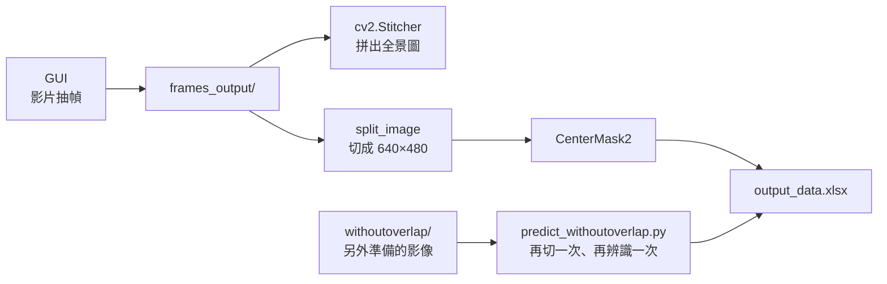
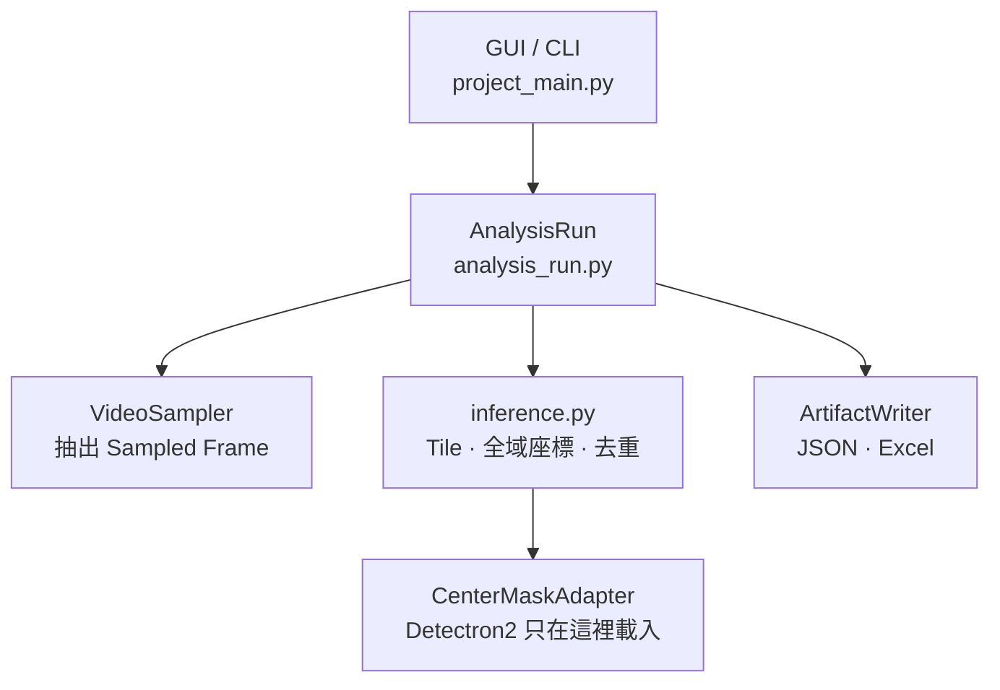

2023 年底到 2024 年秋天，我在大學專題裡寫了一套海灘垃圾辨識程式：無人機影片抽幀、切成小圖丟進 CenterMask2 做實例分割，最後把各類垃圾的數量跟面積寫進 Excel。那時候的 commit 訊息長這樣：

```text
bb55de1  07/27 影像分割+預測+拼接  一定要整包下載！！！
```

兩年後，我把這份程式碼重構了兩次。第一次交給 Claude Code，它交出四個看起來很完整的 commit；第二次，我把其中大半拆掉了。

這篇記錄兩次重構差在哪裡。結論先講：**沒有基準（baseline）的重構，就跟沒有對照組的實驗一樣——你不知道這次改動到底改變了什麼。**

<!-- more -->

## 起點：2024 年的程式在做什麼

當年的主程式 `project_main.py` 流程大致如下：



它能跑，也真的交出了專題成果。但現在回頭讀，有四個問題：

**一、同樣的函式有兩份。** `predict_segm.py` 跟 `predict_withoutoverlap.py` 各有一份 `setup_predictor`、`is_on_boundary`、`save_excel`，內容幾乎一樣，類別名稱清單 `['Float', 'Wood', 'Styrofoam', 'Bottle', 'Buoy']` 在這兩個檔案裡一共寫了四次。

**二、兩份切圖邏輯不一樣。** 主程式的 `split_image` 是這樣切的：

```python
# project_main.py（2024，commit 66d674c）
    for y in range(0, h - height + 1, height):
        for x in range(0, w - width + 1, width):
```

`predict_withoutoverlap.py` 則是這樣：

```python
# predict_withoutoverlap.py（2024，commit 66d674c）
        for y in range(0, height, 480):
            for x in range(0, width, 640):
```

差別在 `range` 的終點。前者只切「放得下一整格」的位置，後者連不滿一格的尾巴也切。拿 repo 歷史裡保留的一張 3840×2160 空拍影像來算：2160 ÷ 480 = 4.5，前者只切出 4 列，**最下面 240 px 不會被送進模型**；後者切出 5 列，但最後一列每格只有 640×240。


<p style="font-size:13px;color:#888;text-align:center;margin-top:-10px;">影像取自專題 repo 歷史（commit a77cc57）中的 UAV 空拍影像，格線依 2024 年 <code>split_image</code> 的邏輯繪製。</p>

**三、被切開的物件怎麼算。** 一個寶特瓶剛好壓在兩格的交界上，會被切成兩半、各自被辨識一次。當年的處理方式寫在 `save_excel` 裡：

```python
# predict_withoutoverlap.py（2024，commit 66d674c）
            total_count = class_info["count"] - class_info["boundary_count"] if class_info["count"] > 1 else class_info["count"]
```

`boundary_count` 是「mask 碰到切片邊緣」的物件數。這條公式把它們全部扣掉：被切成兩半的寶特瓶，兩半都碰到邊緣，算進 2 個、又扣掉 2 個，最後變成 0；一個完整、只是剛好貼著邊緣的寶特瓶，也會被扣掉。面積那一欄則沒有扣，兩半的面積照樣加總。

**四、兩個步驟寫同一個檔案。** 主程式先呼叫 `predict_images_in_folder(...)` 寫出 `output_data.xlsx`，再呼叫 `process_images_without_overlap(...)` 寫**同一個路徑**。`pd.ExcelWriter` 預設是覆寫模式，所以最後留下來的只有第二步的結果。`withoutoverlap/` 資料夾裡是另外準備、已經去掉重疊區域的影像，repo 裡找不到產生它的程式。

這些問題有個共同點：模型本身當年用 mAP、IoU 評估過，但**從切圖到 Excel 這一整段，沒有任何方法可以回答「這個數字對不對」**。沒有測試，也沒有一份固定輸入、固定輸出的結果可以比對。

## 第一輪：交給 Claude Code

2026 年 7 月，我讓 Claude Code 對這個 repo 做架構重構。它列出四個候選方案，一個一個實作、各自 commit：

| Commit | 候選方案 | 內容 |
|---|---|---|
| `13f6308` | Candidate 1 | 常數集中到 `PipelineConfig` |
| `8afafa4` | Candidate 2 | 抽出 `predictor/` 套件，加上 Strategy 類別 |
| `b2fd681` | Candidate 3 | 支援 YAML／JSON 設定檔 |
| `732d459` | Candidate 4 | GUI 改用 `VideoProcessor` 服務層 + Observer |

最後還附了一份 `REFACTORING_SUMMARY.md`，寫著「消除 95% 代碼重複」、「從 ~1000 行減少到 ~534 行」。

有些改動是真的有效的。三個重複的共用函式搬進了 `predictor/garbage_predictor.py`，舊腳本改成從那裡 import；常數也集中到了一處。但仔細看，有三個地方不對勁：

**Strategy 類別沒有接上。** Candidate 2 新增了 `OverlapStrategyPredictor` 跟 `NoOverlapStrategyPredictor` 兩個類別（合計約 290 行），也在 `predictor/__init__.py` 匯出了。但在 `994a1aa` 這個版本裡搜尋整個 repo，除了定義跟匯出，沒有任何地方呼叫它們。主程式走的還是原本的 `classify_and_save` 跟 `process_images`。同一份 summary 的最後一行寫的是「**+702 新增行，-165 刪除行**」——說是消除重複，實際上是多了一套沒人用的抽象。

**Observer 從背景執行緒改 UI。** Candidate 4 讓 GUI 在背景執行緒跑影片處理：

```python
# gui.py（第一輪，commit 994a1aa）
        def process_thread():
            processor.process_video(file_path, frame_cut, start_point, end_point)
        
        threading.Thread(target=process_thread, daemon=True).start()
```

`process_video` 在這條執行緒裡呼叫 `self._notify_status("處理中...")`，經過 `GuiAdapter` 轉發後，最後執行的是：

```python
# gui.py（第一輪，commit 994a1aa）
    def on_status_changed(status: str):
        """處理狀態變更"""
        completion_label.config(text=status, fg="black")
```

也就是**從背景執行緒直接改 Tkinter 元件**。Tkinter 的元件只應該在主執行緒操作，這種寫法大部分時候看起來沒事，偶爾才出問題，是最難查的那一種 bug。

**驗證只驗了語法。** summary 列出的驗證方法是「Python AST 編譯檢查（py_compile）、導入測試、配置加載測試、參數驗證測試」。這些能證明程式可以被 import，但沒有任何一項能證明「重構後辨識出來的數量，跟重構前一樣」。

回頭看，agent 很擅長把「一個好架構應該有的東西」補齊：設定檔、抽象基類、設計模式、服務層。它沒有問、我當時也沒有問的是兩個問題：**這個抽象現在被誰呼叫？改完之後，輸出跟改之前一樣嗎？** 第二個問題在這個 repo 裡根本沒有辦法回答，因為從來沒有基準。

## 第二輪：先定名詞，再劃邊界

第二輪我先決定方向，再交給 agent 照計畫實作。方向有四條。

### 1. 先把名詞定下來

新增的 `CONTEXT.md` 只做一件事：規定這個專案裡的名詞，以及**不要用**的同義詞。

```markdown
**Tile**:
A possibly overlapping rectangular region of a Sampled Frame submitted to the model for detection.
_Avoid_: crop, patch
```

2024 年的程式裡，同一個東西叫 `sub_image`、「小圖」、「切割圖像」；「一次執行」則沒有名字，散在 `project_main.py` 的 `__main__` 裡。名詞不統一，邊界就只能靠檔案來劃。定下 **Analysis Run**、**Sampled Frame**、**Tile**、**Detection**、**Artifact** 這五個詞之後，模組怎麼切就很自然了：



第一輪的 Strategy 類別跟 `VideoProcessor` 服務層都拿掉了。`REFACTORING_SUMMARY.md` 沒有刪，但開頭加上一行註記，標明它是「歷史文件」、描述的是已經被取代的中間版本。

### 2. 模型框架只從一個地方進來

除了 `--diagnose` 會讀取套件版本之外，整個專案只有 `CenterMaskAdapter` 會真正載入 Detectron2，而且是等到真的要跑模型時才 import：

```python
# predictor/garbage_predictor.py
        try:
            import torch
            from detectron2.engine import DefaultPredictor
            from centermask.config import get_cfg
        except ImportError as exc:
            raise ConfigError(
                "CenterMask runtime is unavailable. Activate the pinned WSL2 environment: {}".format(exc)
            ) from exc
```

其他模組只認得一個介面：

```python
# inference.py
class DetectionAdapter(Protocol):
    def detect(self, image) -> Sequence[TileDetection]:
        ...
```

這讓切片、座標換算、去重、輸出這些**我自己寫的邏輯**，可以在沒有 GPU 的電腦上用假的 detector 測試。第一輪只驗了語法；第二輪的 `tests/` 驗的是行為：幀數與秒數的換算、切片有沒有蓋到尾端、全黑的切片會不會被跳過、重複的偵測會不會被去掉、JSON 跟 Excel 有沒有正確寫出來。

### 3. Tile：重疊切片、座標轉回、再去重

2024 年「切開的物件扣掉邊緣數」那條公式，換成了三個步驟。第一步，切片之間留重疊，最後一格貼齊影像邊緣：

```python
# inference.py
def _tile_positions(length: int, tile_size: int, overlap: float) -> Tuple[int, ...]:
    if length <= tile_size:
        return (0,)
    stride = max(1, int(round(tile_size * (1.0 - overlap))))
    final_start = length - tile_size
    positions = list(range(0, final_start + 1, stride))
    if positions[-1] != final_start:
        positions.append(final_start)
    return tuple(positions)
```

預設重疊 10%，步長是 576 × 432 px。同一張 3840×2160 影格會切成 7 × 5 = 35 格，每一格都是完整的 640×480，不會再有漏掉的尾巴或半格：


<p style="font-size:13px;color:#888;text-align:center;margin-top:-10px;">同一張影格，格線依 2026 年 <code>inference.iter_tiles</code> 的邏輯繪製。</p>

對應的測試直接把「尾端有沒有被蓋到」寫成斷言：

```python
# tests/test_inference.py
    def test_tiles_cover_the_trailing_edges(self):
        self.assertEqual(_tile_positions(7, 4, 0.25), (0, 3))
        self.assertEqual(_tile_positions(5, 4, 0.25), (0, 1))
        self.assertEqual(_tile_positions(3, 4, 0.25), (0,))
```

第二步，每個偵測框加上切片的位移，換回整張影格的座標。第三步，同類別、框的 IoU 達到門檻（預設 0.5）的偵測視為重複，只留信心分數最高的那個：

```python
# inference.py
def class_aware_nms(
    detections: Iterable[Detection], iou_threshold: float
) -> List[Detection]:
    kept = []
    for candidate in sorted(detections, key=lambda item: item.score, reverse=True):
        duplicate = any(
            candidate.class_id == existing.class_id
            and bbox_iou(candidate.bbox, existing.bbox) >= iou_threshold
            for existing in kept
        )
        if not duplicate:
            kept.append(candidate)
    return sorted(kept, key=lambda item: (item.class_id, item.bbox[1], item.bbox[0]))
```

「碰到切片邊緣」這個資訊還在，但用法不一樣了。2024 年它被拿去扣數量，藏在公式裡；現在它是 Excel 裡的一個欄位「接觸切片邊緣」，**留給看報表的人判斷**，不再默默改動數字。

### 4. GUI：從 Observer 換成事件佇列

背景執行緒不再碰任何 UI 元件，只把事件丟進佇列：

```python
# gui.py
        def worker():
            try:
                result = AnalysisRun(selected_config).execute(video_path, post_progress)
                events.put(("completed", result))
            except Exception as exc:
                events.put(("error", exc))
```

主執行緒每 100 ms 用 `root.after(100, poll_events)` 把佇列裡的事件取出來，再更新進度條跟狀態文字。這比第一輪的 Observer 少了一個介面、一個 adapter，也少了一個執行緒問題。

## 刻意不做的事：不升級 PyTorch

CenterMask2 的官方環境是 PyTorch 1.7 加 CUDA 10.1，以 2026 年來說相當舊。第二輪我刻意**沒有**升級它，而是把舊環境原樣釘住：

```yaml
# environment.yml
  - python=3.8
  - pytorch=1.7.1
  - torchvision=0.8.2
  - cudatoolkit=10.1
```

理由寫在 `docs/adr/0001-run-centermask-in-wsl2.md` 的最後一句：

> upgrading the model stack is a separate, golden-output-guarded migration.

意思是：升級模型框架是另一次獨立的遷移，而且要有一份 golden output（固定輸入下的標準輸出）當護欄。如果這次同時重構程式、又升級框架，而辨識結果變了，我不會知道是哪一個造成的。這跟做實驗一次只改一個變因是同一件事。

## 還沒做完的事

這次重構有三件事還沒完成，必須寫清楚：

1. **還沒拿原本的模型權重跑過。** 所有行為測試用的都是假的 detector；README 也寫明，正式使用前要先在 WSL2 用既有模型做一次 GPU smoke test。換句話說，「重構後的辨識結果跟 2024 年一樣」目前**還沒有被驗證**。而且 2024 年沒有留下任何可以比對的輸出，所以真正的第一步，是先產生第一份 golden output。
2. **範圍變窄了。** 現在的版本是「一支影片 → 逐幀偵測」的工具。2024 年的影像拼接跟海灘清潔指數（CCI／PAI）計算不在這一版裡。Excel 的「數量」是所有抽樣幀的偵測次數加總：同一件垃圾如果出現在好幾個抽樣幀，就會被算好幾次。要數出「海灘上實際有幾件垃圾」，需要拼接或跨幀追蹤，這是下一步。
3. **大物件仍可能重複。** 水平重疊 64 px、垂直重疊 48 px，代表不超過 64 × 48 px 的物件一定完整落在某一格裡。更大的物件如果壓在交界上，可能一格看到一半、另一格看到全部；兩個框的 IoU 不到 0.5，就會被當成兩件。被切到的那一半會被標成「接觸切片邊緣」，至少查得到。

## 小結

兩次重構之間，差的不是程式寫得漂不漂亮，而是三件事：

1. **抽象要看現在有誰在用。** agent 補上的是「好架構應該有的樣子」，但沒有被呼叫的抽象不是彈性，是維護成本。第二輪最大的改動其實是刪除。
2. **驗證要驗行為，不是驗語法。** 用 `Protocol` 把模型隔開之後，切片、座標、去重、輸出這些我自己的邏輯，都能在 CPU 上用假資料測試；模型本身，則要靠 golden output。
3. **沒有 baseline，就不知道改動帶來了什麼。** 這次最大的遺憾，是 2024 年沒有留下一份固定輸入、固定輸出的結果。重構也好、換模型也好、調參數也好，都應該先固定一個基準，再一次只改一件事。

### 延伸閱讀

- [reedlin2002/project](https://github.com/reedlin2002/project) — 本文所有程式碼的出處；2024 年的版本可以從 commit `66d674c` 查看
- [youngwanLEE/centermask2](https://github.com/youngwanLEE/centermask2) — CenterMask2 官方 repo
- [空拍影像辨識技術地圖：分割策略、模型架構與影像拼接的技術取捨](/2026/08/23/uav-vision-notes/) — 這套系統用到的實例分割、評估指標與拼接原理
